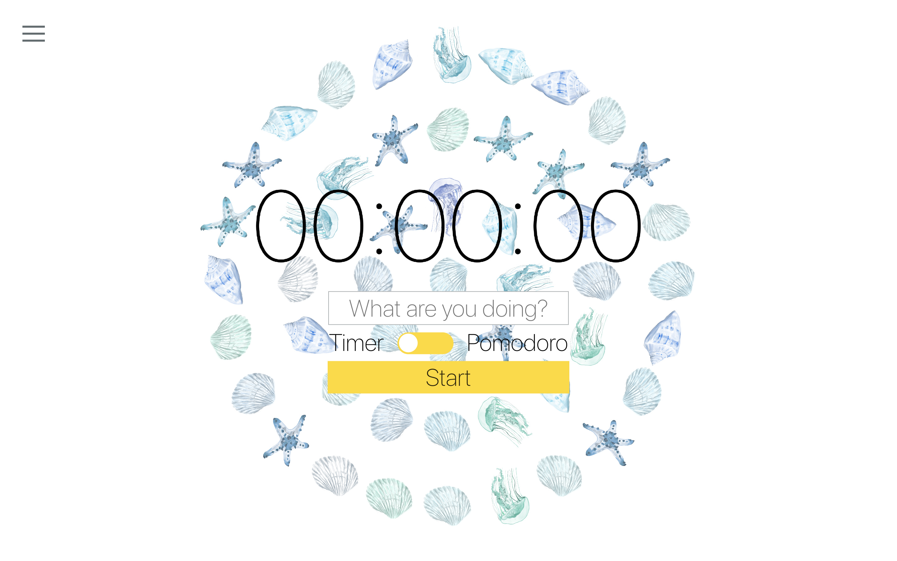
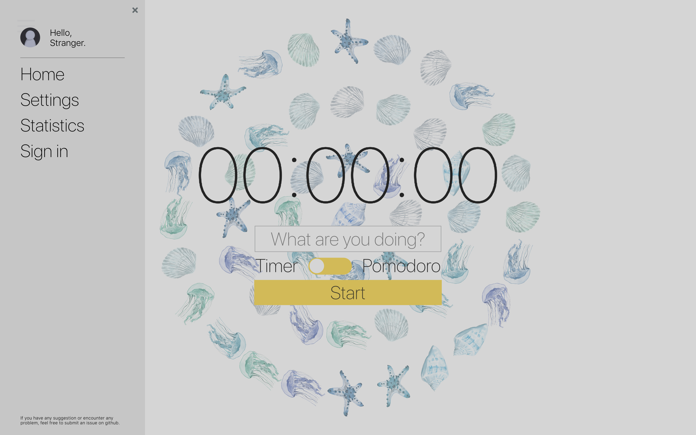
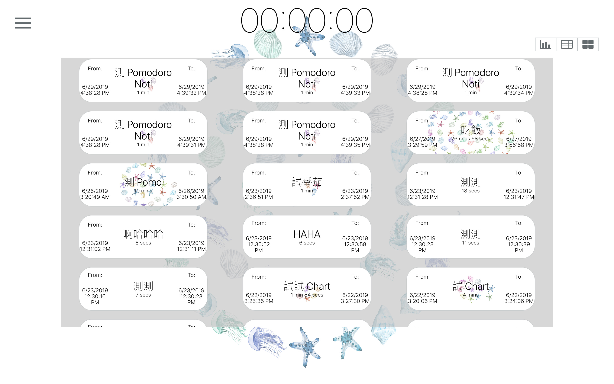
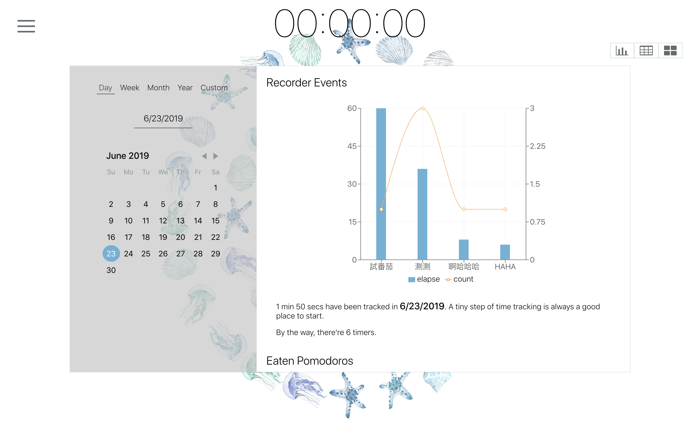
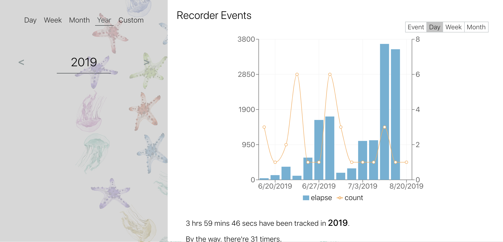
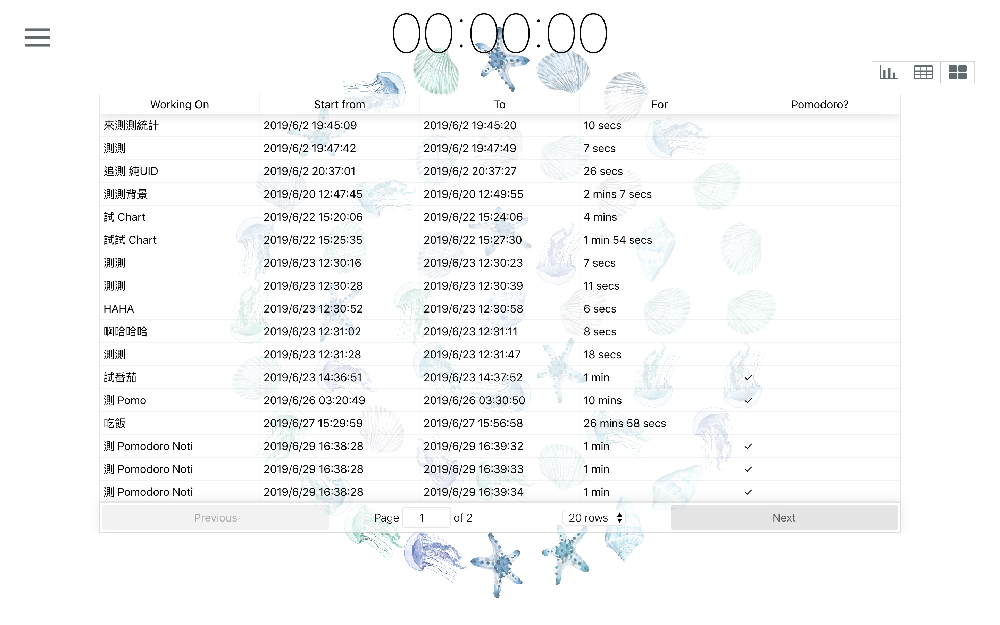
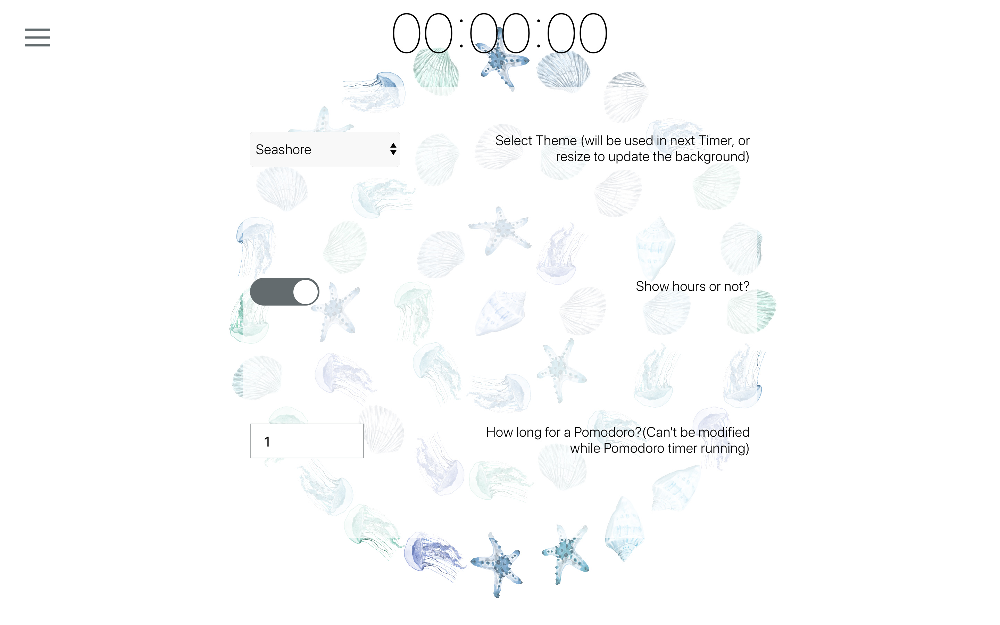

# Life Recorder

## What is Life Recorder

A Timer use Web APIs to record surrounding sound and visualize the signal to capture a glimpse of your life.

## Deployed Link

[https://liferecorder.herokuapp.com](https://liferecorder.herokuapp.com)

## How to use

Your can use Deployed version, but if you want to run it locally, remember to fill firebase setting in `src/containers/Timer.js` and mongoDB setting in `models/entry.js` and `models/user.js`.

## Introduction

### Feature

* Use AnalyserNode in WebAPIs to process the sound collected(via FFT(Fast Fourier Transform)), and this website will only use the information processed by AnalyserNode, so user won't have to worry about privacy.
* Three different presentations of data
* Mobile Responsive UI Design
* RESTful backend API

### Main/Timer

The main page of Life Recorder. You can start/stop a Pomodoro/Normal timer in this page, and enter the title of it. Background will be the sound information collected in previous timer, and when user just visited the website, it will be random generated information.

Drawer implement via `react-burger-menu`, user information implement via `firebase`'s auth library.

### Statistics

#### Cards

User previous Timers displayed in small cards.
Future improvement: user can use cards for note-taking, Add Date Picker(implemented in backend, working on frontend UI).

#### Charts

Five Different Date Picker, with Two Statistic chart(All Timer/Pomodoro) with four different data Presentation(like image below).

#### Table

Table for all events recorded.
Future improvement: Add Date Picker(implemented in backend, working on frontend UI).

### Setting

Some basic user setting, all setting will sync to backend.
Future improvement: While adding more feature, expand the setting.

## Using packages/ References

### Using

* Web Audio API: To record audio and analyze in analyzer node.
* query-string: Used to communicate to backend
* react-burger-menu: Burger-menu in react.js
* react-responsive: To implement mobile responsive
* reactjs-popup: Show sign-in popups
* react-switch: Switch between option
* firebase: Use auth package to implement OAuth sign-in
* react-p5-wrapper: draw background
* Notification: Notify user the end of Pomodoro Timer.
* react-table: Present Data in table format
* moment.js: Process time format
* react-day-picker: Use to pick chart rang(day/week)
* react-infinite-scroller: Use to load cards
* normalize.css: normalize browser difference
* node-sass: Use sass

### Reference

* react-month-picker: Due to it design style is so different to other part in this project, I write an alternative on my own.
* stackoverflow
* MDN
* Google Developers - Web
