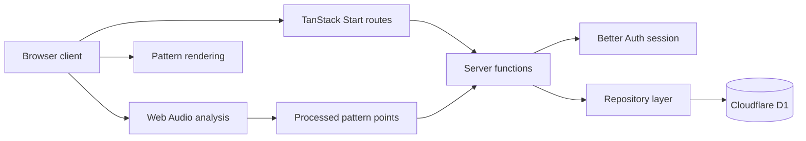

# Modern Structure Refactor - Plan

## Goal Capsule

- **Objective:** Modernize Life Recorder from a non-working 2019 split frontend/backend demo into one deployable full-stack SSR application that keeps the existing timer, audio-pattern capture, statistics, settings, and signed-in history experience.
- **Product authority:** Preserve the current Life Recorder identity first; favor future client-side ML and interaction experiments second; keep free or near-free demo hosting as a hard constraint.
- **Planning status:** Implementation-ready. The plan resolves the framework, hosting, auth, data, documentation, and verification shape enough for a modernization branch to begin.
- **Execution posture:** Rewrite into a modern full-stack app while preserving product behavior through characterization, focused unit tests, and browser checks. Do not attempt to revive the old CRA/Express runtime as the migration vehicle.
- **Open blockers:** No known product blocker remains. Runtime compatibility risks are handled as early implementation gates with documented fallbacks.

---

## Product Contract

### Summary

Life Recorder should become a modern full-stack SSR app that is easy to deploy for free, easier to maintain than the current split app, and suitable for later browser-side ML interaction work. The modernization should keep the current app's core user value: recording focused time, deriving non-raw audio patterns from microphone input, and reviewing those records through visual summaries.

### Problem Frame

The current project is frozen in a 2019 shape: Create React App with React 16, a separate Express backend, Firebase client auth, hardcoded local server configuration, Mongoose models with empty connection strings, and a Heroku deployment link that no longer works. Running or deploying the app now requires reviving old packages and coordinating two app surfaces for a backend that is small.

The refactor is not just dependency maintenance. The project is likely to become an experimentation surface for richer browser-side sound or image interactions, so the new structure should make client-heavy interactive work pleasant while keeping server-owned data and auth simple.

### Key Decisions

- **Preserve before replacing.** The current repository state is preserved on `obsolete-2019`; modernization work continues from the mainline through normal merge-request style branches.
- **Prefer one full-stack app.** The backend is small enough that a separate backend machine is unnecessary for the modern demo.
- **Bias toward experimentation, bounded by free hosting.** Framework and deploy choices should prefer later Web Audio, canvas, and client-side ML work, while staying realistic for low-traffic free hosting.
- **Replace Firebase auth.** The modern app should use a server-owned auth/session model rather than reviving Firebase UI as the primary auth system.
- **Keep future ML out of this refactor.** The modernization should prepare the project for client-side ML experiments, but it should not redesign the product around ML in the first refactor.

### Requirements

**Project preservation and workflow**

- R1. The old code state must remain recoverable from the `obsolete-2019` branch.
- R2. The modernization branch must preserve decisions in `docs/` before implementation begins, so future work can resume after context loss.
- R3. The eventual refactor result should land through classic branch and merge-request workflow rather than as undocumented direct edits.

**Application shape**

- R4. The refactored app must be one full-stack SSR application with server-side routes or functions for auth, preferences, and records.
- R5. The app must preserve the existing user journey: sign in, configure timer preferences, run normal or Pomodoro timers, capture non-raw audio-derived pattern points, and review past records.
- R6. The app must keep microphone privacy posture: store processed pattern data, not raw audio.
- R7. The app must support the current statistics surfaces in spirit: card history, table history, and charted summaries over time ranges.
- R8. The app must keep visual pattern rendering as a first-class part of the product, even if the drawing implementation changes.

**Auth, data, and deploy**

- R9. Auth must move away from Firebase client UI toward a modern server-session approach that can support OAuth sign-in and protected data access.
- R10. Data storage must support users, preferences, and timer entries without requiring a paid always-on server for demo traffic.
- R11. Deployment must target a free or free-friendly service suitable for low traffic demos.
- R12. The chosen stack must have a credible path for SSR plus browser-only interactive code, including Web Audio and canvas-like rendering.

**Future direction**

- R13. The modernization should create room for richer client-side ML or signal-processing interactions after the baseline app works.
- R14. Future ML exploration should be treated as follow-up product work unless planning proves the modernization must move to a new repository.
- R15. If the modernized app becomes only a stable archive/demo and ML becomes the main product, the plan should document a split: keep this repo for the refactor result and start a new repo for the ML product.

### Key Flows

- F1. Signed-in recording
  - **Trigger:** A signed-in user starts a timer.
  - **Steps:** The app runs the timer, periodically samples microphone data through browser APIs, stores processed pattern points with the completed entry, and displays the entry in history surfaces.
  - **Outcome:** The user can revisit the record without exposing raw audio.
  - **Covered by:** R5, R6, R7, R8.

- F2. Preference sync
  - **Trigger:** A signed-in user changes theme, Pomodoro length, or hour display preference.
  - **Steps:** The app saves the preference through the full-stack server surface and rehydrates it on later visits.
  - **Outcome:** Settings survive reloads and new sessions.
  - **Covered by:** R4, R5, R9, R10.

- F3. Demo deployment
  - **Trigger:** A visitor opens the public demo URL.
  - **Steps:** The app serves the interactive timer and visual shell from a free-friendly host, then gates persistent recording behind sign-in.
  - **Outcome:** The project is inspectable as a live demo without maintaining separate frontend and backend deployments.
  - **Covered by:** R4, R9, R10, R11.

### Acceptance Examples

- AE1. Given a signed-in user completes a normal timer with microphone permission granted, when they open Cards, Table, or Charts, then the new entry appears with processed pattern data and no raw audio payload.
- AE2. Given a signed-in user changes Pomodoro minutes, when they reload the app or open it in another browser session, then the updated preference is restored.
- AE3. Given an anonymous visitor opens the demo, when they inspect the app before signing in, then they can understand the timer experience but cannot persist private history as another user.
- AE4. Given the app is deployed to the chosen free-friendly host, when no separate backend process is running, then auth, records, preferences, and SSR pages still work through the full-stack app.

### Success Criteria

- The modernized baseline is deployable from one app project.
- The public demo no longer depends on Heroku.
- The app can be developed without configuring Firebase client UI.
- The stored record model remains recognizable: user-owned timer entries with title, start time, end time, elapsed seconds, Pomodoro flag, and processed pattern points.
- The chosen architecture leaves browser-only interaction code isolated from server rendering hazards.
- The documentation tells a future contributor whether to continue ML exploration in this repo or start a new repository.

### Scope Boundaries

#### In Scope

- Creating a modern full-stack SSR structure.
- Replacing auth and session handling.
- Replacing or adapting the current persistence layer for low-ops hosting.
- Migrating the existing product surfaces at parity before adding new interaction ideas.
- Updating project docs so later planning and implementation can resume safely.

#### Deferred for Later

- New client-side ML interaction design.
- Image processing features.
- Advanced analytics beyond the current chart/card/table concept.
- Native mobile app work.
- Paid hosting optimization.

#### Outside This Product's Identity

- Storing raw microphone recordings as the primary product data.
- Turning the app into a generalized productivity suite.
- Optimizing for high-traffic production operations before the demo baseline exists.

### Dependencies / Assumptions

- The expected traffic is low enough that free-tier limits are acceptable.
- The project owner is comfortable prioritizing future experimentation over the absolute fastest migration path.
- The current user data, if any exists outside this repository, is not yet treated as a mandatory production migration source.
- Planning should compare Next.js, TanStack Start, and OpenNext-style deployment against the requirements above before locking implementation.

### Outstanding Questions

#### Deferred to Planning

- Which full-stack framework should become canonical: Next.js, TanStack Start, or Next.js through OpenNext on Cloudflare?
- Which auth library best fits the chosen runtime and providers: Auth.js, Better Auth, or a host-integrated option?
- Which free-friendly database should back the demo: a Postgres service, a document store, or another host-integrated store?
- Should the refactor result remain in this repo permanently, or should this repo become the stable baseline while a later ML-first product starts in a new repository?
- Does any real user data need migration, or can the modernized app start with a clean demo database?

### Sources / Research

- `Readme.md` documents the original product scope, Heroku deployment link, Firebase auth, MongoDB setup notes, and Web Audio privacy posture.
- `frontend/package.json` shows the current Create React App, React 16, Firebase, p5, and legacy visualization dependencies.
- `backend/package.json` shows the current Express, Pug, and Mongoose backend.
- `backend/routes/users.js` contains the current user, preference, task, card, and time-range route surface.
- `backend/models/entry.js` and `backend/models/user.js` define the current timer entry and user preference shapes.
- `frontend/src/containers/Timer.js` contains the current auth, timer, preference sync, notification, and microphone analysis behavior.
- Next.js migration guidance: https://nextjs.org/docs/app/guides/migrating/from-create-react-app
- Next.js deployment guidance: https://nextjs.org/docs/app/getting-started/deploying
- TanStack Start overview: https://tanstack.com/start/latest/docs/framework/react/overview
- Cloudflare TanStack Start guide: https://developers.cloudflare.com/workers/framework-guides/web-apps/tanstack/
- OpenNext for Cloudflare: https://opennext.js.org/cloudflare
- Auth.js getting started: https://authjs.dev/getting-started
- Better Auth docs: https://www.better-auth.com/docs/introduction
- Supabase pricing: https://supabase.com/pricing
- Vercel limits overview: https://vercel.com/docs/limits/overview

---

## Planning Contract

### Product Contract Preservation

The Product Contract above is preserved from the brainstorm artifact. This implementation plan resolves the planning-owned questions in a new section rather than rewriting the product scope.

### Resolved Planning Decisions

- **Framework:** Use TanStack Start as the canonical full-stack framework, deployed on Cloudflare Workers.
  - **Why:** It keeps React, SSR, server functions, and Vite-oriented client experimentation in one app while aligning with Cloudflare's official TanStack Start deployment path. The project owner also wants to try a non-Next.js platform after having enough Next.js experience.
  - **Fallback:** If the first scaffold validation finds a blocking TanStack Start or Cloudflare runtime issue, fall back to Next.js on Cloudflare through OpenNext before considering Vercel.

- **Hosting:** Target Cloudflare Workers as the demo host.
  - **Why:** The project is low traffic, Cloudflare supports free-friendly Workers deployments, and the same platform can host server functions plus D1 persistence. Each tiny demo can still be its own Worker/project with its own `workers.dev` address or custom subdomain; the plan does not require building one large umbrella website for all demos.
  - **Fallback:** If Cloudflare SSR/runtime limits become the blocker rather than implementation effort, use Vercel for the demo and document the tradeoff. Do not switch to Vercel merely because it is more familiar.

- **Database:** Use Cloudflare D1 for the modernization baseline.
  - **Why:** The current data model is small and relational enough for SQLite: users, preferences, timer entries, and processed pattern points.
  - **Fallback:** If auth or local-development tooling makes D1 too costly for this demo, use a free Postgres service such as Supabase or Neon, keeping the app-side repository interfaces unchanged.

- **Auth:** Use Better Auth as the planning default, with server-owned sessions and OAuth sign-in.
  - **Why:** It fits the "replace Firebase UI with modern server auth" requirement and keeps auth logic inside the full-stack app.
  - **Fallback:** If Better Auth is not viable on the Cloudflare runtime with the chosen persistence layer, use Auth.js for the same auth contract before changing hosting.

- **Migration style:** Rewrite the app shell and server surface instead of incrementally upgrading CRA, Express, Firebase UI, and Mongoose in place.
  - **Why:** The existing dependencies are old enough that incremental resurrection would spend effort on the obsolete shape the refactor is meant to remove.

- **Data migration:** Start with a clean demo database unless real production data is supplied later.
  - **Why:** The repository contains empty connection strings and no dump or migration source; preserving the schema shape is required, importing real records is not.

- **Future ML repository direction:** Keep this repo as the modern Life Recorder baseline. Start a new repo only if the later ML concept becomes a different product rather than an enhancement to timer/audio visualization.
  - **Why:** The immediate work is identity-preserving modernization. Splitting now would create coordination overhead before the new product exists.

- **Project instructions:** Add root `AGENTS.md` and `CLAUDE.md` during the refactor branch.
  - **Why:** This repo is being worked through agent-assisted planning and future merge-request style branches; root handoff instructions reduce context loss.

### Target Architecture



The modern app has one deployable surface:

- SSR routes render the timer, history, charts, and settings shell.
- Client-only modules own microphone access, timer ticks, canvas or visual rendering, and browser notifications.
- Server functions own auth checks, preference reads/writes, timer-entry writes, and history queries.
- A repository layer isolates D1 from product code so a fallback database does not force feature rewrites.

### Data Model

The new schema should preserve the current record shape while making ownership explicit:

- **User:** provider identity, display information, timestamps.
- **Preference:** user id, theme name, Pomodoro minutes, show-hours flag.
- **Entry:** user id, title, start time, end time, elapsed seconds, Pomodoro flag, processed pattern data, timestamps.

Pattern data should be stored as structured JSON or a D1-compatible text/JSON field. It must contain only derived signal data needed to redraw the visual pattern; raw audio samples or recordings stay out of scope.

### Route and Feature Shape

The exact TanStack Start generated filenames can shift with the scaffold, but the implementation should preserve this feature structure:

- `src/routes/` for top-level pages and route loaders.
- `src/features/timer/` for timer state, Pomodoro behavior, recording lifecycle, and completion flow.
- `src/features/audio/` for Web Audio setup, analysis, permission states, and processed pattern extraction.
- `src/features/history/` for cards, table, filtering, and shared history queries.
- `src/features/charts/` for chart transforms and visual summaries.
- `src/features/settings/` for preference editing and persistence.
- `src/auth/` for auth configuration and session helpers.
- `src/db/` for schema, database client, and migrations.
- `src/server/` for server functions, repository adapters, and validation.
- `src/components/` for reusable UI primitives and visual rendering components.

### Implementation Principles

- Preserve behavior before improving visuals. A refreshed UI is acceptable, but do not make a landing page or marketing shell the main work.
- Keep browser-only code behind explicit client boundaries so SSR never touches `window`, `navigator`, `AudioContext`, canvas, or notification APIs.
- Keep server functions narrow and user-owned. Every preference and entry query must be scoped to the authenticated user.
- Prefer small repository interfaces over leaking D1, SQL, or auth-library details into route components.
- Use `npm` and `package-lock.json` unless the selected scaffold requires a different lockfile. Do not keep both lockfile families.
- Remove obsolete Firebase, Express, Mongoose, CRA, Pug, and Heroku configuration once the replacement surface exists and is verified.

### Alternatives Considered

- **Next.js on Vercel:** Most stable and fast to scaffold, but less aligned with the user's free-hosting plus future client-heavy experimentation preference, and it keeps the project tied to Vercel's platform defaults.
- **Next.js on Vercel with Neon:** Strong many-small-projects ergonomics and familiar generated URLs, but it repeats the Next.js path the project owner explicitly wants a break from for this project.
- **Next.js with OpenNext on Cloudflare:** Strong fallback because it combines the Next ecosystem with Cloudflare hosting, but it adds an adapter layer before the project has enough complexity to justify it.
- **Keep CRA plus Express:** Lowest conceptual rewrite, but it preserves the exact split deployment and obsolete dependency problem the refactor is meant to solve.
- **Supabase-first app:** Good free-friendly auth/data path, but it introduces an external backend service before testing whether Cloudflare can host the full demo surface.

### Risks

- **TanStack Start maturity:** If RC-level framework churn blocks deployment, switch to the documented fallback rather than debugging framework internals for too long.
- **Auth on edge runtime:** Validate Better Auth, session cookies, OAuth callback handling, and D1 adapter behavior before porting all UI.
- **D1 local/prod differences:** Keep database access behind a repository layer and test against the same migration schema used by local development.
- **SSR browser API hazards:** Treat Web Audio, notifications, canvas, and timer loops as client-only from the first implementation unit.
- **Scope creep into ML:** Do not add image processing, audio classification, model downloads, or new interaction design until the baseline app is deployed.
- **Real data appears later:** If a real MongoDB or Firebase dataset is supplied, create a separate migration plan rather than folding it into this modernization branch.

---

## Implementation Units

> **Handover status (2026-06-27):** All 8 units implemented on branch
> `refactor/modernization`. Automated gates pass locally: `npm run typecheck`,
> `npm run lint`, `npm test` (75 tests), `npm run build`, and
> `npx wrangler deploy --dry-run` (D1 binding recognized). SSR smoke verified
> for `/`, `/history`, `/settings`, `/api/auth/*` (all HTTP 200, no SSR errors).
> **Remaining manual gates** (need real Cloudflare + GitHub OAuth credentials):
> deployed smoke test, OAuth callback round-trip, and secure-cookie attribute
> check — documented in `docs/deployment.md`. Legacy code preserved on
> `obsolete-2019`; `frontend/`/`backend/` removed from the active branch.

### U1. Repository Handoff and Modern Scaffold ✅

**Goal:** Establish the modern app skeleton, root project instructions, and branch-friendly documentation before moving product behavior.

**Files and areas:**

- Add or update `AGENTS.md`.
- Add or update `CLAUDE.md`.
- Update `README.md` to describe the modern app once the scaffold exists.
- Update `docs/README.md` to point to this plan and future refactor docs.
- Replace top-level package metadata with the selected TanStack Start scaffold files:
  - `package.json`
  - `package-lock.json`
  - `tsconfig.json`
  - `vite.config.ts`
  - `app.config.ts` or the current TanStack Start equivalent
  - `wrangler.jsonc`
  - `.dev.vars.example`
- Create the initial `src/` directory structure listed in the Planning Contract.

**Implementation notes:**

- Preserve the existing `obsolete-2019` branch; do not delete old code until the new scaffold is present in the modernization branch.
- Root agent docs should point to `docs/plans/2026-06-27-001-refactor-modern-structure-plan.md` as the active authority for modernization.
- The first build does not need full product behavior, but it must prove SSR, local dev, and Cloudflare target configuration are coherent.

**Verification:**

- `npm install`
- `npm run typecheck`
- `npm run build`
- `npx wrangler deploy --dry-run` or the closest current Cloudflare validation command available after scaffold setup

**Covers:** R1, R2, R3, R4, R11, R12.

### U2. Persistence Model and Repository Layer ✅

**Goal:** Replace Mongoose models with a D1-backed schema and repository layer that preserves user preferences and timer-entry semantics.

**Files and areas:**

- `src/db/schema.ts`
- `src/db/client.ts`
- `src/db/migrations/`
- `src/server/repositories/users.ts`
- `src/server/repositories/preferences.ts`
- `src/server/repositories/entries.ts`
- `src/server/repositories/*.test.ts`

**Implementation notes:**

- Map the legacy `Entry` model to the new `entries` table: user owner, title, start time, end time, elapsed seconds, Pomodoro flag, processed pattern data.
- Map the legacy `User` preference fields to the new preferences table: theme name, Pomodoro minutes, show-hours flag.
- Use a repository interface that can be backed by D1 now and replaced with Postgres later if the fallback path is needed.
- Treat a clean demo database as the baseline. Do not invent a Mongo migration without a source dataset.

**Verification:**

- Repository tests cover create user, upsert preference, create entry, latest entries, all entries, and time-range query behavior.
- Tests verify one user's entries and preferences are not returned for another user.
- Tests verify pattern data is stored as processed data and contains no raw audio payload field.

**Covers:** R5, R6, R7, R10, AE1, AE2.

### U3. Auth and Session-Owned Server Functions ✅

**Goal:** Replace Firebase client auth with server-owned session handling and protected data access.

**Files and areas:**

- `src/auth/config.ts`
- `src/auth/session.ts`
- `src/server/auth.ts`
- `src/server/functions/preferences.ts`
- `src/server/functions/entries.ts`
- `src/server/validation.ts`
- `src/server/functions/*.test.ts`
- Environment examples in `.dev.vars.example`

**Implementation notes:**

- Configure Better Auth with an OAuth provider suitable for a demo deployment.
- Keep user creation, session lookup, and protected server function guards centralized.
- If Better Auth cannot run correctly with the Cloudflare/D1 runtime during this unit, switch this unit to Auth.js while preserving the same session contract for later units.
- Anonymous visitors can view the timer shell but cannot persist private history.
- Use secure, httpOnly, sameSite cookies according to the chosen auth library's Cloudflare deployment guidance.
- Add CSRF or origin protections for state-changing server functions where the chosen framework/auth stack does not already provide equivalent protection.
- Validate server-function inputs with shared schemas. Never trust a client-supplied user id for authorization or ownership.

**Verification:**

- Tests or integration checks cover anonymous rejection for writes.
- Tests or integration checks cover signed-in preference read/write.
- Tests or integration checks cover signed-in entry create/read with user scoping.
- Tests or integration checks cover forged user ids failing to read or write another user's preferences or entries.
- Manual deployed check confirms session cookies use the intended secure attributes for the deployed environment.
- Manual local check confirms sign-in redirects and session restoration after reload.

**Covers:** R4, R5, R9, R10, AE2, AE3, AE4.

### U4. Timer, Audio Analysis, and Pattern Rendering ✅

**Goal:** Rebuild the core recording experience with SSR-safe browser modules and preserve the no-raw-audio privacy posture.

**Files and areas:**

- `src/routes/index.tsx` or the scaffold's home route equivalent
- `src/features/timer/timer-state.ts`
- `src/features/timer/TimerPanel.tsx`
- `src/features/audio/audio-analyser.ts`
- `src/features/audio/audio-permission.ts`
- `src/features/audio/pattern.ts`
- `src/components/PatternCanvas.tsx`
- `src/features/timer/*.test.ts`
- `src/features/audio/*.test.ts`

**Implementation notes:**

- Port the normal timer and Pomodoro timer behavior before changing interaction design.
- Replace direct component-level Firebase and fetch calls with server functions from U3.
- Prefer native React/canvas rendering over keeping `p5` unless preserving the old visual effect is cheaper and still SSR-safe.
- Handle microphone denied/unavailable states as a normal UI state.
- The completion flow should create an entry only after the timer completes or the user explicitly saves.

**Verification:**

- Unit tests cover timer start, pause/stop if implemented, completion, elapsed seconds, and Pomodoro flag behavior.
- Audio tests cover analyser setup behind browser capability checks and processed-pattern extraction from mocked frequency/time-domain data.
- Browser check confirms no SSR crash when loading the route.
- Browser check confirms a completed signed-in timer writes a processed pattern entry.

**Covers:** R5, R6, R8, R12, AE1, AE3.

### U5. History, Table, and Chart Surfaces ✅

**Goal:** Recreate the current review surfaces so users can inspect recorded time through cards, tables, and charted summaries.

**Files and areas:**

- `src/routes/history.tsx` or nested history routes
- `src/features/history/HistoryCards.tsx`
- `src/features/history/HistoryTable.tsx`
- `src/features/history/history-queries.ts`
- `src/features/charts/TimeSummaryChart.tsx`
- `src/features/charts/chart-transforms.ts`
- `src/features/history/*.test.ts`
- `src/features/charts/*.test.ts`

**Implementation notes:**

- Preserve the old route semantics in spirit:
  - latest card records
  - all records for table display
  - time-range records for charts
- Use modern table/chart libraries only where they are worth their dependency cost. A simple table is acceptable if it preserves the user workflow.
- Keep pattern preview visible in card/history contexts where the old app emphasized visual records.

**Verification:**

- Tests cover latest-entry sorting, all-entry display order, time-range filtering, and chart transform correctness.
- Browser check confirms a newly created entry appears in the history cards, table, and chart surfaces.
- Browser check confirms empty state rendering for a signed-in user with no entries.

**Covers:** R5, R7, R8, AE1.

### U6. Settings and Preferences ✅

**Goal:** Preserve configurable timer preferences and theme/display settings through the new full-stack app.

**Files and areas:**

- `src/routes/settings.tsx`
- `src/features/settings/SettingsForm.tsx`
- `src/features/settings/preferences-client.ts`
- `src/features/settings/preferences-schema.ts`
- `src/styles/`
- `src/features/settings/*.test.ts`

**Implementation notes:**

- Preserve Pomodoro minutes, show-hours preference, and theme name from the legacy model.
- Keep defaults usable for anonymous visitors and new signed-in users.
- Settings should persist only for the authenticated user.

**Verification:**

- Tests cover default preferences, updating preferences, and reload/session restoration.
- Browser check confirms changing Pomodoro minutes affects the timer.
- Browser check confirms reloading restores saved preferences for a signed-in user.

**Covers:** R5, R9, R10, AE2.

### U7. Deployment and Runtime Configuration ✅

**Goal:** Make the app deployable as a single free-friendly demo without Heroku or a separate backend process.

**Files and areas:**

- `wrangler.jsonc`
- `.dev.vars.example`
- `README.md`
- `docs/deployment.md`
- Optional `.github/workflows/deploy.yml` only if the repo uses GitHub Actions for deployment.

**Implementation notes:**

- Configure Cloudflare Workers deployment and D1 bindings.
- Document the minimum required secrets and local development variables without committing secret values.
- Ensure auth callback URLs and cookie settings work in local and deployed environments.
- Remove Heroku-specific documentation from the main setup path. Historical references can stay in docs only when clearly marked obsolete.

**Verification:**

- `npm run build`
- Cloudflare dry-run or preview command succeeds.
- Manual deployed smoke test covers opening the app, signing in, saving preferences, recording an entry, and reading history without running any separate backend.

**Covers:** R4, R9, R10, R11, AE4.

### U8. Cleanup, Documentation, and Future Direction ✅

**Goal:** Finish the refactor as a coherent baseline and document how later ML/client-side interaction work should proceed.

**Files and areas:**

- `README.md`
- `docs/README.md`
- `docs/architecture.md`
- `docs/future-client-ml.md`
- Remove or archive obsolete `frontend/` and `backend/` code after parity is verified.

**Implementation notes:**

- Document the chosen stack, why it was chosen, and the fallback path that was considered.
- Document the browser-only interaction boundary so future ML work does not break SSR.
- Document that this repo remains the Life Recorder baseline; new ML repos should be created only for product concepts that outgrow the timer/history identity.
- Remove obsolete install and deploy instructions that tell contributors to configure Firebase, MongoDB empty strings, or Heroku.

**Verification:**

- A fresh contributor can follow `README.md` to install, configure local env, run tests, run the app, and understand deployment.
- Docs clearly identify `obsolete-2019` as the legacy snapshot branch.
- `rg "firebase|heroku|mongoose|Create React App|react-scripts"` finds only intentional historical references or no references.

**Covers:** R1, R2, R3, R13, R14, R15.

---

## Verification Contract

### Automated Gates

After the relevant scripts exist, the modernization branch should pass:

```bash
npm run typecheck
npm run lint
npm test
npm run build
```

Cloudflare validation should pass after U1 and again after U7 using the scaffold's current Worker validation command. If the final script names differ, record the actual command in `README.md` and `docs/deployment.md`.

### Browser Smoke Gates

Run these locally before considering the branch ready:

- Anonymous visitor can open the app and see the timer shell without signing in.
- Anonymous visitor cannot save private history.
- Signed-in user can change preferences, reload, and see them restored.
- Signed-in user can complete a normal timer and see the record in cards, table, and chart surfaces.
- Signed-in user can complete a Pomodoro timer and see the Pomodoro flag represented in history.
- Microphone denied state does not crash the app.
- A route reload does not throw SSR errors from browser-only APIs.

### Data and Privacy Gates

- Entries are scoped by authenticated user.
- Preference reads and writes are scoped by authenticated user.
- Stored pattern data is derived signal data only.
- No server endpoint accepts or stores raw audio recordings.
- Demo seed data, if added, is clearly marked and not mixed with private user data.

### Deployment Gate

The final modernization branch is not complete until the app can be deployed as one service and the deployed smoke test proves:

- SSR route loads.
- Auth callback completes.
- D1 or fallback database binding works.
- Preference write/read works.
- Entry write/read works.
- No separate Express backend process is required.

---

## Definition of Done

- ✅ `obsolete-2019` remains the recoverable legacy branch.
- ✅ The main modernization branch contains one full-stack app structure rather than active split `frontend/` and `backend/` apps.
- ✅ Firebase client UI, Express server routing, Mongoose models, Heroku setup, and CRA scripts are removed from the active app path.
- ✅ Auth is server-owned (Better Auth + D1 sessions) and protects user data; every server function derives ownership from the session, not the payload.
- ✅ Preferences and timer entries persist through Cloudflare D1 via the repository layer.
- ✅ Timer, audio pattern extraction, pattern rendering, history cards, table, charts, and settings all exist at baseline parity.
- ⏳ The public demo deploys on Cloudflare without a separate backend machine — config + dry-run validated; actual deploy is a manual gate needing real credentials (`docs/deployment.md`).
- ✅ The README and docs explain setup, deployment, architecture, and future ML direction.
- ✅ Automated verification gates pass (typecheck, lint, 75 tests, build, dry-run). The deployed smoke test is the one skipped gate, documented above with its concrete prerequisites.

---

## Handoff Notes

- Work from a new implementation branch off this planning branch or from `main` after this plan is merged.
- Start with U1, then U2 and U3 before rebuilding UI features that need persistence.
- Treat Better Auth, D1, and Cloudflare runtime compatibility as the first technical validation point. If it fails, switch to the documented fallback before porting the product surface.
- Do not add client-side ML or image processing in the modernization branch. Preserve the boundary for that future work in docs and architecture.
- Keep merge requests reviewable by grouping scaffold/data/auth/timer/history/deploy/docs work rather than landing the entire rewrite as one opaque commit.
