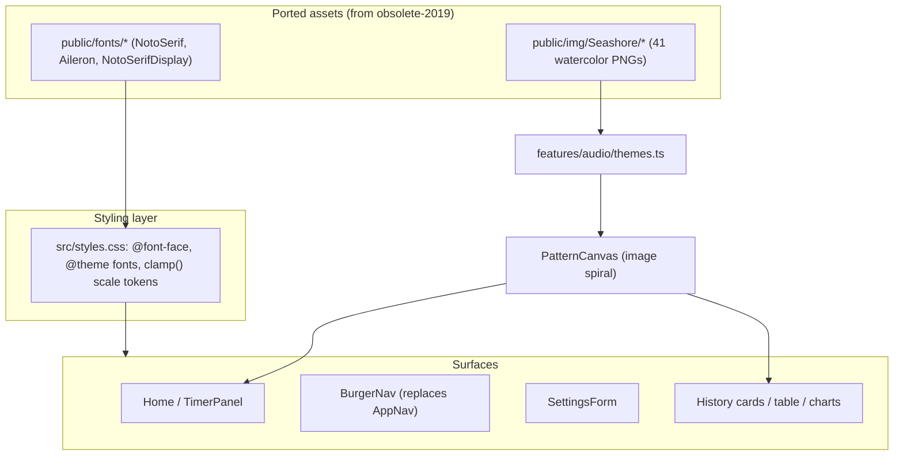

# refactor: UI visual parity with the 2019 Life Recorder

## Summary

Restore the original Life Recorder visual identity on the modern stack. This is a
**presentation refactor**: the 2019 UI/UX is the spec, and TanStack Start +
React 19 + Tailwind v4 + canvas is the implementation. No product behavior, data,
auth, or server-function changes.

**This is essentially an art project.** The heart of the work — and where effort
and fidelity should concentrate — is the **timer / main interface** and the
**picture-spiral logic**. Those must be faithful to the original. The
data/table/chart/settings surfaces are secondary and explicitly **not strict**:
make them clean and reasonable, don't sweat pixel parity.

Fidelity is **tiered** (per user direction during planning):

- **Faithful — the priority (strict SCSS fidelity).** The picture-spiral logic
  (U2, U3), the home/timer screen (U4), and the self-hosted serif fonts (U1).
  The slide-in burger nav (U5) and fluid `clamp()` scaling (U6) support this
  signature surface and follow the SCSS too.
- **Reasonable, not strict.** History table, charts, and settings inputs (U7):
  hand-crafted with Tailwind, the legacy SCSS as a loose reference, refined later
  if ever. Do not spend art-project effort here. (shadcn only if a control gets
  fiddly; no reproduction of the legacy `react-table` / `recharts` /
  `react-day-picker` internals.)

All assets (fonts, the Seashore PNG set, theme JSON, screenshots, legacy CSS as
reference) are recovered from the `obsolete-2019` branch (see origin:
docs/brainstorms/2026-06-27-ui-visual-parity-requirements.md).

---

## Problem Frame

The modernization rebuild preserved behavior but shipped generic Tailwind styling:
sans-serif text, a plain top `AppNav`, and an abstract colored-dot pattern instead
of the watercolor spiral. A user who knew the 2019 app would not recognize it. The
signature identity is specific: thin serif clock numerals, a full-viewport spiral
of watercolor seashell/starfish/jellyfish PNGs, a slide-in burger menu with a
profile block, and a yellow (Timer) / red (Pomodoro) Start bar.

Current UI lives in `src/routes/index.tsx`,
`src/features/timer/TimerPanel.tsx`, `src/components/AppNav.tsx`,
`src/components/PatternCanvas.tsx`, and the history/settings features.

---

## Requirements

Carried from origin (docs/brainstorms/2026-06-27-ui-visual-parity-requirements.md):

- **R1–R2 Fonts.** Self-host the original fonts (NotoSerif body; a thin display
  serif for the clock; Aileron for the modern sans family) and apply them; no
  default system sans on primary surfaces.
- **R3–R4 Spiral + themes.** Render the themed watercolor spiral from the Seashore
  PNG set on the canvas layer; Seashore and Seashore[Blue] both available and
  persisted per user (reuse existing `preferences.themeName`).
- **R5–R6 Home/timer.** Match `Main.jpg`: spiral background, centered serif clock,
  task input, Timer/Pomodoro toggle, yellow/red Start bar; running state shows the
  task title and Pause/Continue/End.
- **R7 Navigation.** Slide-in burger menu (`Menu.jpg`) with profile block, links,
  sign in/out, github link — replacing the top `AppNav`.
- **R8 Settings.** `Setting.jpg` look: translucent panel, serif labels, theme
  select, show-hours toggle, Pomodoro-length input. (Fidelity tier: approximate.)
- **R9 History.** Cards (with spiral preview), table, charts resembling
  `Cards.jpg` / `Table.jpg` / `Charts.jpg`. (Fidelity tier: approximate for table
  and charts; cards keep the spiral preview faithfully.)
- **R10–R11 Scaling.** Fluid `clamp()`/`vw` scaling across viewport width and
  browser zoom, without the original's abrupt 900px/700px size jumps.
- **R12 Constraint.** No p5, no Sass — spiral on the existing canvas, styles in
  Tailwind v4 / CSS.
- **R13 Constraint.** Presentation only — no behavior/data/auth/server changes;
  existing behavior tests keep passing.
- **R14 Constraint.** SSR-safe — fonts, canvas, and burger menu must not access
  `window`/`document` during server render.

---

## Key Technical Decisions

- **Styling Fidelity Rule (strict for U1–U6, loose for U7).** For the faithful
  tier — fonts, the picture spiral, the home/timer screen, the burger nav, and
  scaling (U1–U6) — the legacy SCSS/CSS is the **source of truth** for all visual
  values: fonts, weights, colors, sizes, spacing, borders, radii, positions,
  transitions. **Do not invent or approximate design details there.** For the
  secondary tier (U7 settings/table/charts) the SCSS is a *loose reference* only —
  clean and on-palette is enough. The rest of this rule applies to the strict
  tier: Every style applied must trace to a specific rule
  in `obsolete-2019:frontend/src/Time.scss` (or the other legacy CSS/SCSS), and
  the SCSS variables carry over verbatim: `$checked-color: #e02929` (pomodoro
  red), `$unchecked-color: rgb(255,218,8)` (timer yellow), `$support-color:
  rgb(98,107,110)`, `$pressed-color: rgb(62,68,70)`, `$focus-outline-color:
  rgb(194,200,202)`, `$border-color: rgba(194,200,202,0.692)`, plus the exact
  weights (100–500), `em`/`px` paddings, `0.005em` underlines, and transition
  durations. Translate the value into Tailwind/CSS; never substitute a "close
  enough" Tailwind default (e.g. do **not** use `bg-yellow-400` for the Start bar
  — use the exact `rgb(255,218,8)`). The screenshots are a cross-check, the SCSS
  is the spec. When the legacy value is genuinely absent, surface it as an open
  question rather than inventing one.

- **`clamp()` changes the scaling mechanism, never the look.** `clamp()` replaces
  the legacy three-breakpoint size *swaps* with one fluid rule, but the rendered
  size at each original anchor must match the legacy value: the `max` equals the
  legacy desktop size (e.g. clock `.middleClock` 32px, `.BigClock` 45px), the
  fluid middle uses the legacy `vw` figure (e.g. `.ProtraitmiddleClock` 3.6vw),
  and the `min` equals the legacy small-screen size (e.g. `.U700middleClock`
  4.8vw / `.currentTaskU700` 51px). At the old 900px and 700px widths the output
  is visually identical to the original; `clamp()` only smooths the transitions
  *between* those anchors. It must not make any surface look different from the
  SCSS at the sizes the SCSS defined.

- **Fonts: system-sans with self-hosted Aileron fallback (corrected during
  execution).** Tracing the legacy `Timer.js`, `altFont` defaults `false` and its
  toggle was commented out, so the app **always** renders `modernFont` =
  `$ModernFontFamily: -apple-system, BlinkMacSystemFont, "Segoe UI", Aileron,
  sans-serif`. The `tradFont`/NotoSerif serif is **never applied** — and there is
  no serif clock. The thin clock numerals are simply the system font at
  `font-weight: 100`/`200`. Resolution: do **not** port NotoSerif and do **not**
  fetch NotoSerifDisplay/SourceSerifPro (all unused). Self-host **Aileron only**
  (the cross-platform fallback) into `public/fonts/Aileron/`, and set the app font
  family to the exact legacy stack via `@font-face` + Tailwind `@theme`, not Sass.
  *(This supersedes the original plan's "thin serif clock" framing, which misread
  the legacy font logic.)*

- **Spiral: images on the existing canvas.** Extend `PatternCanvas` to draw the
  theme's watercolor PNGs along the existing spiral layout (ring/angle math
  already present), replacing the abstract `hsl()` dots. Images preload in an
  effect (client-only); SSR renders the bare `<canvas>`. Pattern point `[max, min]`
  still selects image index + rotation, mirroring the legacy `Sketch.js` mapping.

- **Themes: one PNG set, two curated lists.** Port the single Seashore PNG set
  (41 images) to `public/img/Seashore/`. Seashore[Blue] is a **curated blue-toned
  subset of the same files** (per the legacy `SeashoreBlue.json` `imgs` list), not
  a separate asset set. Encode both theme definitions (image list + layout params
  `imgSize`/`radius`) as typed TS constants in `src/features/audio/themes.ts`.

- **Scaling: `clamp()` over breakpoints.** Per the rule above, fold the legacy
  three-breakpoint size swaps into single `clamp()` rules whose anchors are the
  exact legacy values (not invented numbers). Express as Tailwind arbitrary values
  (`text-[clamp(...)]`) or a small CSS layer.

- **Secondary controls: hand-craft first.** History table, charts, and settings
  inputs are hand-crafted with Tailwind. No new component dependency by default;
  reach for shadcn only if a specific control becomes fiddly. The current native
  `HistoryTable`/`TimeSummaryChart` already work — this is styling, not replacement.

- **Burger nav: native, no `react-burger-menu`.** Build a slide-in panel with a
  fixed burger button using Tailwind transitions and React state, replacing the
  top `AppNav`. Reuse the existing SSR-safe `useAuthSession` for profile/auth
  state.

---

## High-Level Technical Design

Surface-to-asset-to-mechanism map:



The data path (timer → pattern points → entries → history) is unchanged; only the
rendering of those points and the surrounding chrome change.

---

## Implementation Units

> **Handover status (2026-06-27):** All 8 units implemented on branch
> `refactor/modernization` (one commit per unit). Automated gates pass:
> `npm run typecheck`, `npm run lint`, `npm test` (98 tests), `npm run build`,
> `npx wrangler deploy --dry-run`. SSR smoke verified for `/`, `/history`,
> `/settings`, `/api/auth/*` (HTTP 200, no SSR errors). Constraints hold: no
> p5 / Sass / react-burger-menu; Aileron self-hosted (no CDN).
>
> **Execution corrections worth noting:** (1) The font plan was corrected — the
> legacy app always rendered the system-sans + Aileron stack (`modernFont`); the
> NotoSerif serif and the "thin serif clock" were never used. Only Aileron is
> self-hosted; the clock is the system font at weight 100. (2) "Two themes" =
> one Seashore PNG set with two image lists (Blue is the blue-toned subset).
>
> **Not done by design (user steer):** secondary-surface (settings/table/charts)
> fidelity is intentionally light — clean and on-palette, not pixel-matched. The
> user will fine-tune small visual details themselves. No automated visual/
> screenshot diff was run (no browser tooling available in the session); parity
> was verified against the legacy SCSS values and screenshots by construction.

### U1. Port fonts and wire font families ✅

**Goal:** Self-host the original fonts and make them the app's type families.

**Requirements:** R1, R2, R14.

**Dependencies:** none.

**Files:**
- `public/fonts/` (new — NotoSerif TTF, Aileron OTF from obsolete-2019; NotoSerifDisplay from Google Fonts)
- `src/styles.css` (add `@font-face` blocks + Tailwind `@theme` font families)
- `src/components/__tests__/fonts.test.ts` (or co-located) — assert font-family tokens resolve

**Approach:** Copy font files via `git show obsolete-2019:frontend/public/<path>`.
Add weight-mapped `@font-face` (mirror `obsolete-2019:frontend/src/NotoSerif.css`)
in `src/styles.css`. Define families in Tailwind v4 `@theme`
(`--font-serif`, `--font-display`, `--font-sans`). No Sass.

**Patterns to follow:** legacy `@font-face` weight mapping in
`obsolete-2019:frontend/src/NotoSerif.css`; current Tailwind `@import` in
`src/styles.css`.

**Test scenarios:**
- Build includes the font assets (no 404 path) and `@theme` exposes the families.
- Test expectation: light — mostly static assets/CSS; a smoke assertion that the
  display/serif/sans utility classes apply the expected family names.

**Verification:** Home clock renders in the thin display serif; build succeeds;
no SSR error.

### U2. Port the Seashore PNG set and theme definitions ✅

**Goal:** Bring over the watercolor image set and encode both themes.

**Requirements:** R3, R4.

**Dependencies:** none.

**Files:**
- `public/img/Seashore/` (new — 41 PNGs from obsolete-2019)
- `src/features/audio/themes.ts` (new — typed theme defs: name, image list, imgSize, radius)
- `src/features/audio/themes.test.ts` (new)

**Approach:** Copy PNGs from `obsolete-2019:frontend/public/img/Seashore/`. Encode
two themes as TS constants: `Seashore` (full list) and `Seashore[Blue]` (the
curated blue subset from the legacy `SeashoreBlue.json` `imgs` list). Keep layout
params (`imgSize`, `radius`, mobile variants) for the canvas to consume.

**Patterns to follow:** `obsolete-2019:frontend/src/themes/Seashore.json` and
`SeashoreBlue.json` shapes.

**Test scenarios:**
- Both themes resolve to image paths that exist under `public/img/Seashore/`.
- Seashore[Blue]'s image list is a subset of Seashore's.
- Each theme exposes positive `imgSize`/`radius`.

**Verification:** `themes.ts` typechecks; tests confirm subset + path validity.

### U3. Render the watercolor spiral on PatternCanvas ✅

**Goal:** Replace the abstract dot spiral with theme watercolor images.

**Requirements:** R3, R8 (visual signature), R14.

**Dependencies:** U2.

**Files:**
- `src/components/PatternCanvas.tsx` (modify — draw images instead of dots; accept a theme)
- `src/components/PatternCanvas.test.tsx` (extend)

**Approach:** Add a `theme` prop (default Seashore[Blue]). In an effect, preload
the theme's images (client-only; guard `typeof window`). Map each pattern point
`[max, min]` to an image index + rotation along the existing ring/angle spiral
math (mirror legacy `obsolete-2019:frontend/src/components/Sketch.js`). Keep the
empty-pattern and no-canvas-context guards. SSR renders the bare element.

**Execution note:** Preserve SSR safety — assert no image/`window` access at
module top level.

**Patterns to follow:** legacy spiral placement in `Sketch.js`; existing canvas
effect + guards in `PatternCanvas.tsx`.

**Test scenarios:**
- Renders the labelled canvas with a non-empty pattern and a theme without throwing.
- Renders with an empty pattern (no images drawn).
- Renders during jsdom (no real canvas) without crashing — SSR-safety proxy.
- Falls back gracefully if an image fails to load (no throw).

**Verification:** Home shows the watercolor spiral; jsdom tests pass; no SSR error.

### U4. Rebuild the home / timer screen to match Main.jpg ✅

**Goal:** Lay out the signature home screen at parity.

**Requirements:** R5, R6, R10, R11.

**Dependencies:** U1, U3.

**Files:**
- `src/routes/index.tsx` (modify — full-viewport spiral background, centered layout)
- `src/features/timer/TimerPanel.tsx` (modify — serif clock, mode toggle styling, yellow/red Start bar, running controls)
- `src/features/timer/TimerPanel.test.tsx` (extend if present; else add)

**Approach:** Position the spiral `PatternCanvas` as a fixed full-viewport
background (legacy `.background` z-index behind). Center the serif clock using the
legacy `.middleClock`/`.BigClock` rules (absolute, translate(-50%,-50%), the exact
font sizes folded into `clamp()` per the Styling Fidelity Rule). Style the
Timer/Pomodoro toggle (`.clockType`, `.Slider`) and the Start bar from the legacy
`@mixin startTimer` — `.startNorTimer` background `rgb(255,218,8)`, `.startPomoTimer`
background `rgb(224,41,41)` color white, `min-width:225px; width:10.1em;
font-size:1.2em; font-weight:200`. Running state uses `.currentTask`/`.BigClock`
and `.TimerControll` (Pause/Continue/End). All values come from the SCSS, not
invented. Keep all existing timer behavior and the `canPersist` anonymous-run
logic untouched.

**Patterns to follow:** the exact `.middleClock` / `.BigClock` / `.clockType` /
`@mixin startTimer` / `.startNorTimer` / `.startPomoTimer` / `.currentTask` /
`.TimerControll` rules in `obsolete-2019:frontend/src/Time.scss` (translate values
verbatim into Tailwind/CSS, do not port Sass and do not approximate);
`Main.jpg` as cross-check.

**Test scenarios:**
- Clock, task input, mode toggle, and Start render in the idle state.
- Running state renders the title and Pause/End; paused renders Continue.
- Anonymous user still sees an enabled Start and the sign-in-to-save hint
  (behavior unchanged from current).
- Covers AE1 (home/timer visually recognizable).

**Verification:** Home matches `Main.jpg` at common widths; behavior tests pass;
SSR 200.

### U5. Replace top nav with the slide-in burger menu ✅

**Goal:** Recreate the burger navigation + profile block.

**Requirements:** R7, R14.

**Dependencies:** U1.

**Files:**
- `src/components/BurgerNav.tsx` (new — fixed burger button + slide-in panel)
- `src/components/ProfileBlock.tsx` (new — avatar + identity, both auth states)
- `public/img/stranger.png` (new — non-login avatar, ported from obsolete-2019)
- `src/components/AppNav.tsx` (remove or replace usage across routes)
- `src/routes/index.tsx`, `src/routes/history.tsx`, `src/routes/settings.tsx` (swap nav)
- `src/components/BurgerNav.test.tsx` (new)
- `src/components/ProfileBlock.test.tsx` (new)

**Approach:** Native slide-in panel with a fixed burger button (Tailwind
transitions + React open/close state; no `react-burger-menu`). Replace `AppNav`
everywhere. Reuse `signIn`/`signOut`/`useAuthSession`.

Profile block (factored into `ProfileBlock.tsx`, mirroring the legacy
`.profileContainer`/`.profileItem` layout — round 41px avatar on the left, stacked
text on the right):
- **Signed-out:** the **`stranger.png`** avatar (ported from
  `obsolete-2019:frontend/public/img/stranger.png`) + a stacked "Hello," /
  "Stranger." label (legacy `.welcomeStranger`), then a "Sign in" action below a
  split line.
- **Signed-in:** the user's `image` (photoURL) avatar + stacked **display name**
  (`.displayName`) and **email** (`.email`), then "Sign out".

Avatar is round (`border-radius: 50%`), ~41px, with a graceful fallback to
`stranger.png` if a signed-in user has no image.

**Patterns to follow:** `Menu.jpg`; legacy `.profileContainer` / `.profileItem` /
`.displayName` / `.email` / `.welcomeStranger` / `.splitLine` / `.bm-*` rules and
the signed-in vs signed-out `userBlock` markup in
`obsolete-2019:frontend/src/containers/Timer.js` (lines ~587–623) and
`obsolete-2019:frontend/src/Time.scss`; current auth wiring in
`src/components/AppNav.tsx`.

**Test scenarios:**
- Burger button toggles the panel open/closed.
- Signed-out: profile block shows the `stranger.png` avatar + "Hello, Stranger"
  and a Sign in action.
- Signed-in: profile block shows the user's avatar + display name + email and a
  Sign out action.
- Signed-in user with no `image` falls back to the `stranger.png` avatar.
- Links render to Home/Settings/History.
- Renders without SSR error (no `window` at module top level).
- Covers AE1 (nav + profile recognizable).

**Verification:** All routes use the burger nav; toggling works; profile block
matches `Menu.jpg` in both auth states (avatar + Hello/Stranger when out, avatar +
name + email when in); SSR 200.

### U6. Apply fluid clamp() scaling system ✅

**Goal:** Smooth proportional scaling across width and zoom, no breakpoint jumps.

**Requirements:** R10, R11.

**Dependencies:** U4, U5.

**Files:**
- `src/styles.css` (add reusable clamp-based scale tokens/utilities)
- `src/features/timer/TimerPanel.tsx`, `src/components/BurgerNav.tsx`, settings/history surfaces (apply tokens)

**Approach:** Define fluid type/spacing tokens whose `clamp()` anchors are the
**exact legacy SCSS values** (per the Styling Fidelity Rule and the `clamp()`
decision): `max` = legacy desktop size, middle = legacy `vw` figure, `min` =
legacy small-screen size — e.g. the clock from `.middleClock` 32px /
`.ProtraitmiddleClock` 3.6vw / `.U700middleClock` 4.8vw; running clock from
`.BigClock` 45px / `.ProtraitBigClock` 5vw; `.currentTask` 66px / 7.3vw / 51px.
Apply across surfaces so resize/zoom is smooth, with the rendered size at the old
900px/700px widths matching the original exactly. Remove any hard 900/700px
breakpoint logic. Do not introduce sizes the SCSS did not define.

**Patterns to follow:** the exact `.middleClock` / `.ProtraitmiddleClock` /
`.U700middleClock` / `.BigClock` / `.currentTask*` font-size values in
`obsolete-2019:frontend/src/Time.scss` as the `clamp()` anchors.

**Test scenarios:**
- Test expectation: none — pure CSS/visual; verified by manual resize/zoom check
  and the browser smoke gate below.

**Verification:** Manual resize from mobile→desktop width scales smoothly with no
abrupt jumps; clock/controls stay centered and proportional.

### U7. Style settings and history surfaces (reasonable, not strict) ✅

**Goal:** Bring settings and history cleanly onto the identity. This is the
secondary, **non-strict** tier — clean and consistent with the look, not an
art-project-grade pixel match. Spend the fidelity effort on U1–U6, not here.

**Requirements:** R8, R9.

**Dependencies:** U1, U3.

**Files:**
- `src/routes/settings.tsx`, `src/features/settings/SettingsForm.tsx` (translucent panel, serif labels, styled inputs/toggle)
- `src/routes/history.tsx`, `src/features/history/HistoryCards.tsx`, `HistoryTable.tsx`, `src/features/charts/TimeSummaryChart.tsx` (styling pass)
- Extend existing component tests where markup/labels change

**Approach:** Hand-craft with Tailwind (shadcn only if a control gets fiddly).
Use the legacy SCSS as a **loose reference** — match the general feel (translucent
panel, serif labels, the timer-yellow/support-grey palette) so these surfaces sit
consistently with the faithful home screen, but do **not** chase exact values
here. The legacy rules to lean on: Settings `.SettingContainer` (translucent
`rgba(255,255,255,0.726)` panel, serif), `.themeSelect`/`.PomoInput`,
`.settingDes`; History cards keep the **image-based spiral preview** (this part
*is* faithful, via U3); table/chart get a clean native styling pass.

**The one strict thing in U7:** the card spiral preview must use the real
image-spiral from U3 — that's part of the art. Everything else (table rows, chart
bars, settings inputs) just needs to look clean and on-palette; reasonable
judgment over pixel matching. No reproduction of the legacy `react-table` v6 /
`recharts` v1 internals.

**Execution note:** Behavior unchanged — update tests only where DOM/labels shift.

**Patterns to follow:** `.SettingContainer` / `.themeSelect` / `.PomoInput` /
`.settingDes` / `.statTable` / `.statMain` rules in
`obsolete-2019:frontend/src/Time.scss` and `obsolete-2019:frontend/src/containers/Cards.scss`;
`Setting.jpg` / `Table.jpg` / `Charts.jpg` as cross-check; existing components in
`src/features/settings/` and `src/features/history/`.

**Test scenarios:**
- Settings still renders defaults, saves on change, reverts invalid Pomodoro input
  (existing behavior preserved).
- History tabs still switch cards/table/charts; empty states still render.
- Cards render the image-based spiral preview per entry.
- Covers AE2 (theme switch persists and changes spiral imagery).

**Verification:** Settings/history look clean and on-palette (loose SCSS
reference); the card spiral preview uses the real U3 image-spiral; existing
behavior tests pass. Pixel parity is explicitly **not** required here.

### U8. Verification pass and asset cleanup ✅

**Goal:** Confirm parity, scaling, SSR safety, and no p5/Sass; tidy assets.

**Requirements:** R12, R13, R14.

**Dependencies:** U1–U7.

**Files:**
- `package.json` (confirm no p5/sass deps added)
- `README.md` / `docs/architecture.md` (note the theme/spiral/font assets if useful)

**Approach:** Run the full gate (typecheck, lint, test, build) and the browser
smoke across all routes. Confirm no `p5`, `react-p5-wrapper`, `sass`, or
`node-sass` entered `package.json`. Side-by-side check against the screenshots.

**Test scenarios:**
- Test expectation: none new — this unit runs the existing suite + manual checks.

**Verification:** See Verification Contract below.

---

## Verification Contract

**Automated gates:**

```bash
npm run typecheck
npm run lint
npm test
npm run build
```

**Browser smoke (manual):**
- Home matches `Main.jpg`: spiral background, serif clock, toggle, Start bar — with
  the exact legacy colors (Start bar `rgb(255,218,8)` / pomodoro `rgb(224,41,41)`).
- Burger nav opens/closes; profile + links + sign in/out present.
- Switching theme changes the spiral imagery and persists across reload (AE2).
- Resize/zoom scales smoothly with no abrupt jumps; at the old 900px/700px widths
  the rendered sizes match the original SCSS (AE3).
- `/`, `/history`, `/settings` all SSR with HTTP 200, no `window`/canvas crash (AE5).

**Fidelity check:**
- Every applied color/size/weight/border traces to a legacy SCSS rule — no invented
  Tailwind-default substitutions. Spot-check against `Time.scss` variables and the
  named rules in each unit.

**Constraint checks:**
- `rg -i "p5|node-sass|\bsass\b|react-burger-menu" package.json` finds nothing (AE4).
- No behavior test regressions (R13).

---

## Scope Boundaries

### In scope
- Self-hosting fonts; porting the Seashore PNG set + two theme definitions.
- Image-based spiral on the existing canvas.
- Home/timer, burger nav, settings, history styling.
- Fluid `clamp()`/`vw` scaling.

### Deferred to Follow-Up Work
- Pixel-perfecting the secondary controls (table/charts/settings inputs) beyond
  the approximate tier — refine later if desired.
- Adopting shadcn as a baseline component system (only pulled in reactively if a
  control proves fiddly).
- Additional themes beyond Seashore / Seashore[Blue].

### Outside this product's identity (from origin)
- Any UX/interaction redesign — this is parity, not redesign.
- Replacing the watercolor-spiral signature with an abstract visual.
- New features or the deferred client-ML work.

---

## Risks & Mitigations

- **Display-serif font missing from branch.** Mitigated by self-hosting
  NotoSerifDisplay from Google Fonts (KTD). If sourcing is undesirable, fall back
  to the present NotoSerif thin weight for the clock.
- **Canvas image preloading vs. SSR.** Mitigated by client-only preloading guarded
  on `typeof window`, with the existing bare-`<canvas>` SSR render and jsdom tests.
- **Scaling regressions on small screens.** Mitigated by `clamp()` min anchors and
  the manual resize smoke check (U6).
- **Scope creep into exact component reproduction.** Mitigated by the explicit
  approximate-tier decision for secondary controls.

---

## Sources / Research

- Origin requirements: docs/brainstorms/2026-06-27-ui-visual-parity-requirements.md
- Legacy styles: `obsolete-2019:frontend/src/Time.scss` (clock, nav, settings),
  `App.css` (CRA boilerplate — not used).
- Legacy fonts: `obsolete-2019:frontend/public/NotoSerif/` (18), `aileron/` (17);
  `NotoSerifDisplay.css`/`SourceSerifPro.css` reference files **without** font
  files on the branch.
- Legacy themes: `obsolete-2019:frontend/src/themes/Seashore.json` (41 images),
  `SeashoreBlue.json` (curated blue subset of the same set).
- Legacy spiral: `obsolete-2019:frontend/src/components/Sketch.js`.
- Legacy deps (for what NOT to reintroduce): `react-burger-menu`, `react-switch`,
  `react-table` v6, `recharts` v1, `react-day-picker` v7, `p5`, `node-sass`.
- Screenshots: `obsolete-2019:img/{Main,Menu,Setting,Cards,Table,Charts}.jpg`.
- Current UI: `src/routes/index.tsx`, `src/features/timer/TimerPanel.tsx`,
  `src/components/AppNav.tsx`, `src/components/PatternCanvas.tsx`.

---

## Definition of Done

- Self-hosted fonts applied; clock renders in the thin display serif.
- Watercolor spiral renders from theme PNGs on the canvas; both themes work and
  persist.
- Home, burger nav, settings, and history match the screenshots (signature
  surfaces faithfully; secondary controls at approximate tier).
- Fluid `clamp()` scaling replaces breakpoint jumps; resize/zoom is smooth.
- No p5 or Sass; presentation-only; all existing behavior tests pass.
- Automated gates green; browser smoke and constraint checks pass.
