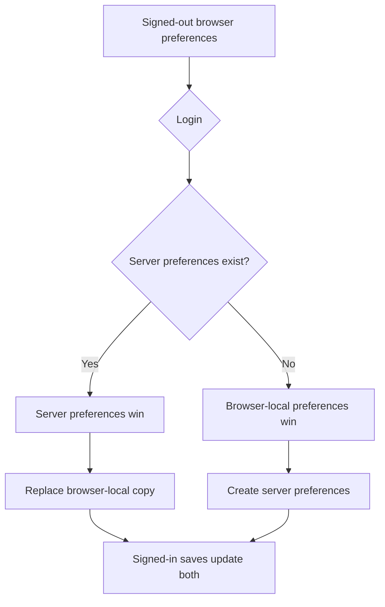
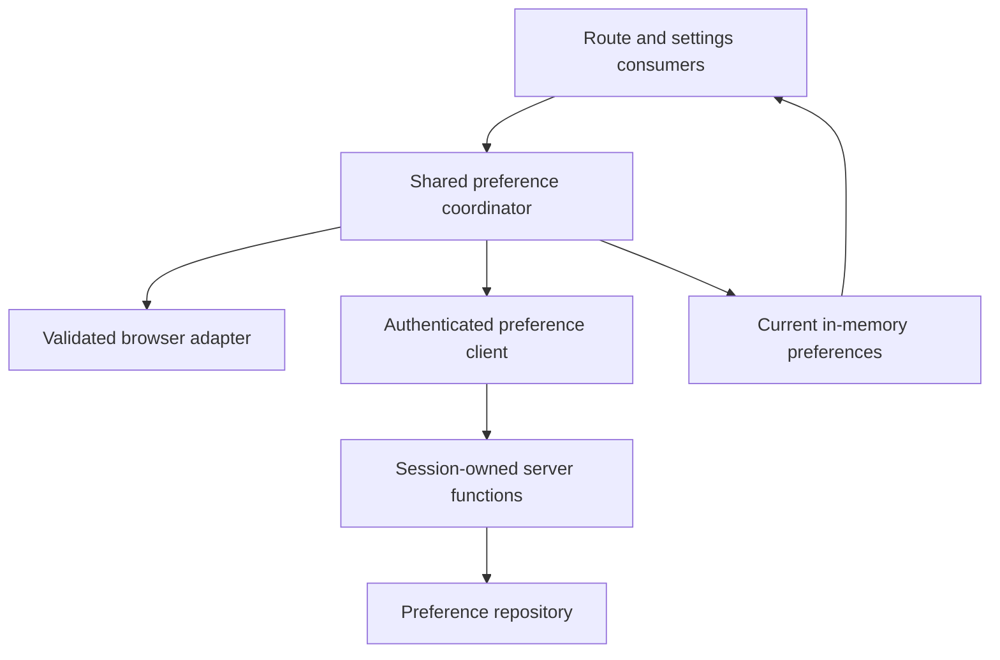
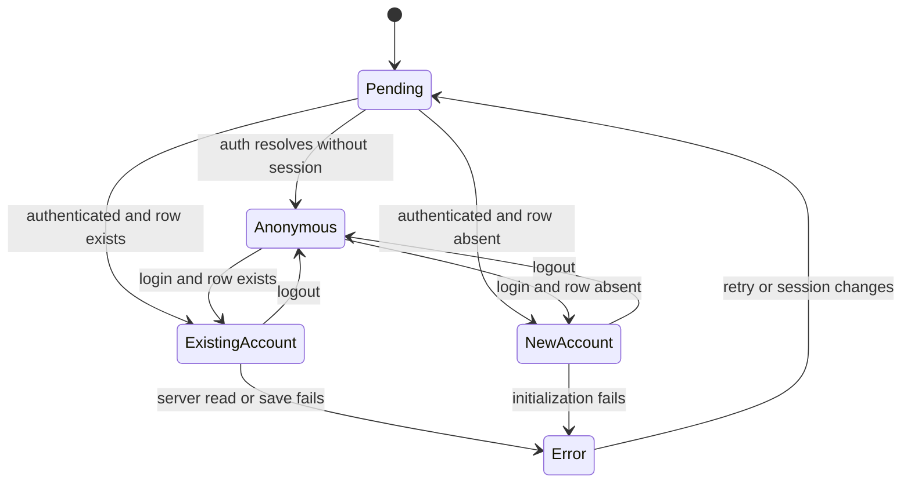

# Anonymous Experience and Preference Sync - Plan

## Goal Capsule

- **Objective:** Make every product page useful while signed out and synchronize browser-local settings with account settings at login.
- **Product authority:** The confirmed behavior in this document governs anonymous demo history, the timer sign-in banner, and preference precedence.
- **Open blockers:** None.
- **Execution profile:** Standard, cross-cutting client/server preference synchronization with authentication-sensitive branching.
- **Stop conditions:** Stop if implementation would expose personal data anonymously, accept a user ID from the client, or cannot distinguish a missing preference row from a failed read.
- **Tail ownership:** The executor runs the full repository gate and SSR/browser smoke checks; commit, push, and PR creation remain user-directed.

---

## Product Contract

### Summary

Signed-out visitors can explore demo history and customize settings without authenticating.
Preferences persist locally and synchronize predictably with server settings when an account session becomes available.

### Key Decisions

- **Demo data is anonymous-only.** Signed-out visitors see representative history, while signed-in users see only their own history, including a real empty state.
- **Server preferences win when they exist.** Login replaces browser-local preferences with an existing account's settings so established accounts remain authoritative.
- **Local preferences initialize new accounts.** When an authenticated account has no stored preference record, its current browser-local settings become the initial server settings.
- **Signed-in saves update both stores.** Keeping the browser copy current makes logout continue seamlessly with the most recently synchronized preferences.

### Actors

- A1. A signed-out visitor exploring the timer, history, and settings.
- A2. A signed-in user with an existing server preference record.
- A3. A signed-in user whose account has no server preference record yet.

### Requirements

**Anonymous page access**

- R1. Every product page must render useful content without requiring authentication.
- R2. Signed-out History must show demo sessions across its cards, table, and chart views.
- R3. Demo sessions must never be presented as the signed-in user's personal history.

**Timer guidance**

- R4. The anonymous timer persistence note must appear as a small floating white banner over the bottom of the timer page.
- R5. The banner must have rounded corners and remain visually separate from the centered timer controls.

**Preference persistence and synchronization**

- R6. Signed-out visitors must be able to edit settings, with changes surviving refreshes and future signed-out visits in the same browser.
- R7. Login with existing server settings must apply those settings and replace the browser-local copy.
- R8. Login without server settings must upload the browser-local settings as the account's initial settings.
- R9. Signed-in settings changes must update both the server settings and the browser-local copy.
- R10. Logout must leave the most recently synchronized settings available to the signed-out experience.

**Data boundaries**

- R11. Anonymous timer sessions must remain non-persistent and must not be mixed into demo or personal history.
- R12. Personal history and server preference operations must continue to derive ownership from the authenticated session.

### Key Flows

- F1. Anonymous exploration
  - **Trigger:** A1 opens History or Settings without a session.
  - **Steps:** History loads demo sessions; Settings loads the browser-local preferences or defaults; changes are saved locally.
  - **Outcome:** Both pages are functional without exposing personal server data.
  - **Covered by:** R1, R2, R3, R6, R11, R12.
- F2. Existing-account login
  - **Trigger:** A2 authenticates in a browser containing local preferences.
  - **Steps:** The account's stored settings are loaded, applied to the product, and copied into browser-local storage.
  - **Outcome:** Server settings remain authoritative and signed-out use after logout starts from the synchronized values.
  - **Covered by:** R7, R9, R10, R12.
- F3. New-account login
  - **Trigger:** A3 authenticates and no server preference record exists.
  - **Steps:** The current browser-local preferences, or defaults when none exist, are saved as the account's initial settings.
  - **Outcome:** Anonymous customization carries into the new account.
  - **Covered by:** R8, R9, R10, R12.

### Acceptance Examples

- AE1. **Covers R2 and R3.** Given a signed-out visitor, when they open History and switch among cards, table, and charts, then each view uses demo sessions and no personal entries are requested or shown.
- AE2. **Covers R3.** Given a signed-in user with no entries, when they open History, then they see the real empty state rather than demo sessions.
- AE3. **Covers R6.** Given a signed-out visitor who changes the theme and Pomodoro duration, when they refresh or revisit Settings, then those local choices remain selected.
- AE4. **Covers R7 and R10.** Given local settings that differ from an existing account's server settings, when that account logs in and later logs out, then the server values were applied and remain in the local signed-out experience.
- AE5. **Covers R8.** Given customized local settings and an account without server settings, when the visitor logs in, then those local values become the account's stored settings.
- AE6. **Covers R11 and R12.** Given a signed-out visitor who finishes a timer, when they visit History, then the completed timer is neither persisted nor inserted into the demo dataset.

### Scope Boundaries

- Anonymous history uses fixed representative demo data; it does not save or merge anonymous timer sessions.
- This work does not weaken authentication on server functions that access personal entries or account-owned preferences.
- Cross-browser anonymous preference synchronization is outside scope because no account identity exists while signed out.

---

## Planning Contract

**Product Contract preservation:** Product Contract unchanged.

### Key Technical Decisions

- KTD1. **Use one root-owned client preference coordinator.** A provider mounted once in the shared root owns reactive session state, browser hydration, auth reconciliation, server synchronization, and current in-memory preferences; route hooks consume its context rather than creating independent coordinators.
- KTD2. **Keep browser persistence behind a validated adapter.** A client-safe module reads and writes one versioned local-storage value, validates it with the existing form schema, and falls back to defaults for missing, malformed, or stale values without touching browser globals during SSR.
- KTD3. **Expose authenticated preference presence explicitly.** The server read contract returns whether a row exists plus canonical values when present; generic failures remain errors and must never be treated as an absent row.
- KTD4. **Make server success authoritative while signed in.** Existing server settings replace the local copy; an atomic initialize-if-absent operation lets the first new-account initializer win and returns the canonical stored row to every contender; subsequent saves are serialized so completion order matches user intent, and only successful canonical responses update the local copy.
- KTD5. **Keep demo history outside repositories.** A deterministic, client-safe fixture matching the existing history entry shape feeds cards, table, and chart surfaces only when the route has confirmed there is no authenticated session.
- KTD6. **Centralize auth transitions and distinguish failure from anonymity.** The root provider observes login, logout, and account changes for all consumers. Pending and failed session lookups must not choose the anonymous demo/local branch, and async work from an obsolete session or unmounted consumer must be ignored.

### High-Level Technical Design

### Sequencing and Dependencies

1. Establish the browser adapter and presence-aware server contract before coordinating synchronization.
2. Build the shared coordinator against those contracts before migrating route consumers.
3. Add demo History and timer-banner presentation after the state sources are stable.
4. Run focused tests first, then the full repository, SSR, and browser verification gates.

### Error and Race Policy

- A failed session or authenticated preference read preserves the current valid in-memory values, shows a synchronization warning with an explicit Retry action, and does not enter the confirmed-anonymous branch or seed/overwrite server settings.
- A failed authenticated save leaves controls editable and the browser-local copy unchanged, uses the existing save-status region to explain that the change is not synchronized, and permits Retry.
- Auth-pending pages keep their stable navigation and page shell, announce a loading state, and withhold demo/personal content plus preference-dependent controls until the session resolves; this avoids false data and layout-shifting substitute content.
- New-account initialization is atomic: concurrent callers receive the same canonical stored row, and losing callers apply it locally rather than overwriting it.
- Same-session saves are serialized in user-action order so an older request or response cannot become the final local or server value after a newer edit.
- Session changes invalidate in-flight reconciliation; a response for a prior user cannot update the current preference state.
- Storage access and parsing failures fall back to defaults without breaking page rendering.

### Deferred to Implementation

- Exact hook and helper names may follow the closest existing naming pattern discovered during implementation.

---

## Implementation Units

### U1. Add validated browser preference persistence

- **Goal:** Provide an SSR-safe, versioned local preference adapter with schema validation and deterministic fallback behavior.
- **Requirements:** R6, R10; supports F1-F3 and AE3-AE5.
- **Dependencies:** None.
- **Files:** Create `src/features/settings/local-preferences.ts` and `src/features/settings/local-preferences.test.ts`; reuse `src/features/settings/preferences-schema.ts`.
- **Approach:** Keep all browser-global access inside callable client operations, store the full preference form, validate every read, and make defaults the only fallback for absent or invalid storage.
- **Patterns to follow:** `src/features/settings/preferences-schema.ts` for canonical shape and defaults; `src/auth/useAuthSession.ts` for SSR-safe client initialization.
- **Test scenarios:** Missing storage returns defaults; a valid stored form round-trips; malformed JSON, unknown versions, and schema-invalid fields return defaults; writes persist only validated full forms; invoking module-level code during SSR does not access `window` or `localStorage`.
- **Verification:** The adapter has deterministic behavior in browser and non-browser test environments and exposes no server-only imports.

### U2. Preserve preference-row presence in the authenticated API

- **Goal:** Let clients distinguish an existing account preference row from a genuinely absent row without weakening ownership.
- **Requirements:** R7, R8, R9, R12; supports F2, F3 and AE4, AE5.
- **Dependencies:** None.
- **Files:** Modify `src/server/repositories/preferences.ts`, `src/server/repositories/preferences.test.ts`, `src/server/functions/preferences.ts`, and `src/features/settings/preferences-client.ts`; add or extend the nearest server-function preference test file.
- **Approach:** Use the repository's existing nullable lookup behind `requireUser()` and return an explicit presence result. Add a session-owned initialize-if-absent operation whose insert conflict returns the existing canonical row instead of updating it; keep ordinary updates session-owned and return canonical persisted values.
- **Execution note:** Start with a failing contract test proving that “missing row” and “stored defaults” are distinguishable while unauthorized access still fails.
- **Patterns to follow:** `src/server/repositories/preferences.ts` nullable `find` and `upsert`; `src/server/functions/entries.ts` session-derived ownership; `src/server/validation.ts` client payloads without user IDs.
- **Test scenarios:** Authenticated read with no row returns the absent result; an existing row containing default values returns present; an existing customized row returns canonical values; two concurrent initializers with different values return the same first-writer canonical row; anonymous reads, initialization, and writes are rejected; payloads cannot select another user; repository or binding failure propagates as an error rather than absence.
- **Verification:** The client can branch on presence, and all server preference access remains authenticated and session-scoped.

### U3. Coordinate local and server preference synchronization

- **Goal:** Provide one reactive preference source that enforces the confirmed login, save, and logout precedence across routes.
- **Requirements:** R6-R10, R12; supports F1-F3 and AE3-AE5.
- **Dependencies:** U1, U2.
- **Files:** Create `src/features/settings/PreferencesProvider.tsx`, `src/features/settings/usePreferences.ts`, and focused provider/hook tests; modify `src/routes/__root.tsx`, `src/routes/index.tsx`, `src/routes/settings.tsx`, `src/features/settings/SettingsForm.tsx`, `src/auth/useAuthSession.ts`, and its focused tests.
- **Approach:** Mount one provider in the shared root and expose its context through `usePreferences`. Treat auth pending, confirmed anonymous, session error, existing-account, new-account, and preference error as explicit states. Hydrate local values only after mount; on authenticated presence choose server-wins or atomic local-seeds-server once per resolved session; serialize signed-in saves and expose current values, loading/error status, Retry, and save operations to route consumers.
- **Execution note:** Implement synchronization test-first with controllable deferred promises so account switches and stale completions are proven before route integration.
- **Patterns to follow:** `src/auth/useAuthSession.ts` rather than Better Auth's SSR-unsafe hook; existing SettingsForm save-status behavior; TanStack route loaders only for SSR-safe server data.
- **Test scenarios:** Covers AE3: anonymous local values hydrate and persist across remount; Covers AE4: existing server values replace differing local values and remain after logout; Covers AE5: concurrent missing-row initialization applies the server's canonical winner locally; root consumers share one state and reconciliation runs once per resolved session; rapid saves resolve in user-action order and leave the latest intent on server and client; signed-in save updates local only after server success; read/save failures preserve the last valid state, keep controls editable, show Retry, and recover after retry; pending auth and rejected session lookup never commit an anonymous decision; same-page login/logout/account changes update all consumers together; stale responses after account change or unmount are ignored; SettingsForm and timer receive reconciled updates rather than frozen loader initials.
- **Verification:** `/` and `/settings` consume the same precedence logic, and no browser storage is read during SSR.

### U4. Show anonymous demo history without bypassing personal-data auth

- **Goal:** Render representative data across all History tabs only for confirmed signed-out visitors.
- **Requirements:** R1-R3, R11, R12; supports F1, AE1, AE2, AE6.
- **Dependencies:** U3.
- **Files:** Create `src/features/history/demo-entries.ts` and `src/features/history/demo-entries.test.ts`; modify `src/routes/history.tsx`; extend `src/features/history/history-surfaces.test.tsx` or add a focused route test.
- **Approach:** Define deterministic synthetic entries containing processed pattern points only. Keep protected personal queries behind the authenticated branch and preserve the signed-in empty result without substituting demos.
- **Patterns to follow:** `src/db/schema.ts` entry shape; `src/features/history/HistoryCards.tsx`, `HistoryTable.tsx`, and `src/features/charts/TimeSummaryChart.tsx` as unchanged consumers; `src/features/history/history-surfaces.test.tsx` fixture style.
- **Test scenarios:** Covers AE1: confirmed anonymous state feeds the same fixture to cards, table, and charts; Covers AE2: signed-in empty personal history shows each surface's real empty state; pending and failed session lookup retain the stable History shell with an announced loading/error state and never flash demos; Covers AE6: demo data is fixed and unaffected by anonymous timer completion; fixtures use synthetic user IDs and processed pattern points with no raw audio/image fields; protected personal query failures are not silently replaced with demo data for a signed-in user.
- **Verification:** Anonymous History is useful across all tabs, while authenticated History remains exclusively personal and server-owned.

### U5. Move the anonymous timer note into a bottom overlay

- **Goal:** Present persistence guidance as a small floating banner independent of the centered timer layout.
- **Requirements:** R4, R5.
- **Dependencies:** None.
- **Files:** Modify `src/features/timer/TimerPanel.tsx` and `src/features/timer/TimerPanel.test.tsx`; use `src/styles.css` only if a reusable token or safe-area rule is needed.
- **Approach:** Render the anonymous-only message outside idle/running branches at the bottom viewport edge with a white background, border radius, compact spacing, readable contrast, safe-area clearance, and a stacking order that does not block timer controls.
- **Execution note:** This is primarily presentation work; use component assertions plus browser inspection at mobile and desktop sizes.
- **Patterns to follow:** Existing legacy-derived responsive tokens in `src/styles.css` and fixed-layer conventions in `src/components/BurgerNav.tsx`.
- **Test scenarios:** Anonymous idle and running states both render the banner; signed-in state omits it; the banner is outside the centered control container; its accessible text remains unchanged.
- **Verification:** The timer remains centered and operable while the banner floats above the bottom edge at representative mobile and desktop viewports.

### U6. Integrate and document verification-sensitive behavior

- **Goal:** Prove the cross-route SSR, authentication, and browser synchronization behavior as one system and update durable architecture guidance if contracts changed.
- **Requirements:** R1-R12; supports F1-F3 and AE1-AE6.
- **Dependencies:** U1-U5.
- **Files:** Modify `docs/architecture.md` if the client preference source or preference API contract changes; add the nearest route/browser integration tests supported by the existing harness.
- **Approach:** Exercise anonymous and authenticated routes through real coordination boundaries, retain server/client import protection, and document the local/server preference authority flow.
- **Test scenarios:** SSR renders `/`, `/history`, and `/settings` without browser-global access or hydration errors; pending auth retains stable shells and withholds state-dependent content; anonymous navigation exposes demo history and editable settings; existing-account and new-account login follow opposite precedence branches; concurrent initialization converges on one canonical row; rapid saves preserve latest user intent; login/logout/account changes update all pages without reload; session and preference errors show recoverable UI and never masquerade as anonymity; logout retains synchronized settings; signed-in empty history never shows demos; `/api/auth/*` continues to respond without render errors.
- **Verification:** All focused scenarios and repository gates pass, and architecture documentation accurately describes the implemented source-of-truth transitions.

---

## Verification Contract

| Gate | Applies to | Done signal |
|---|---|---|
| `npm run typecheck` | U1-U6 | No TypeScript errors, including server/client boundary types. |
| `npm run lint` | U1-U6 | No lint violations. |
| `npm test` | U1-U6 | All unit, component, repository, and integration tests pass. |
| `npm run build` | U1-U6 | Client and Cloudflare SSR bundles build with import protection intact. |
| SSR smoke for `/`, `/history`, `/settings`, `/api/auth/*` | U3, U4, U6 | Each route returns successfully with no render or hydration error. |
| Browser flow smoke | U3-U6 | Anonymous demo/settings, both login precedence branches, logout continuity, signed-in empty history, and bottom banner behave as specified. |

---

## Definition of Done

- Every product route is useful while signed out without exposing or mutating personal server data.
- Demo History appears only for confirmed signed-out visitors and works across cards, table, and chart views.
- Anonymous settings survive refresh, existing server preferences win at login, missing server preferences are initialized from local values, and signed-in saves keep both stores synchronized.
- Preference read failures cannot masquerade as missing rows, and stale async work cannot cross account boundaries.
- Concurrent account initialization converges on one canonical server row, and serialized saves preserve the latest user intent.
- Pending and failed auth states never render anonymous demo content; synchronization failures are visible and recoverable through Retry.
- The anonymous timer guidance is a compact white rounded overlay at the bottom of the viewport in idle and running states.
- Personal history and preference server functions remain authenticated, session-owned, and free of client-supplied user IDs.
- Typecheck, lint, tests, build, SSR smoke, and the specified browser flows are green.
- Any changed preference authority or synchronization contract is reflected in `docs/architecture.md`.
