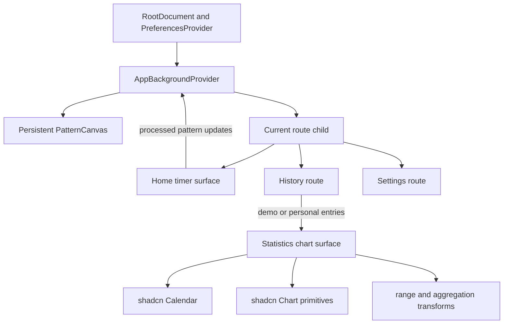
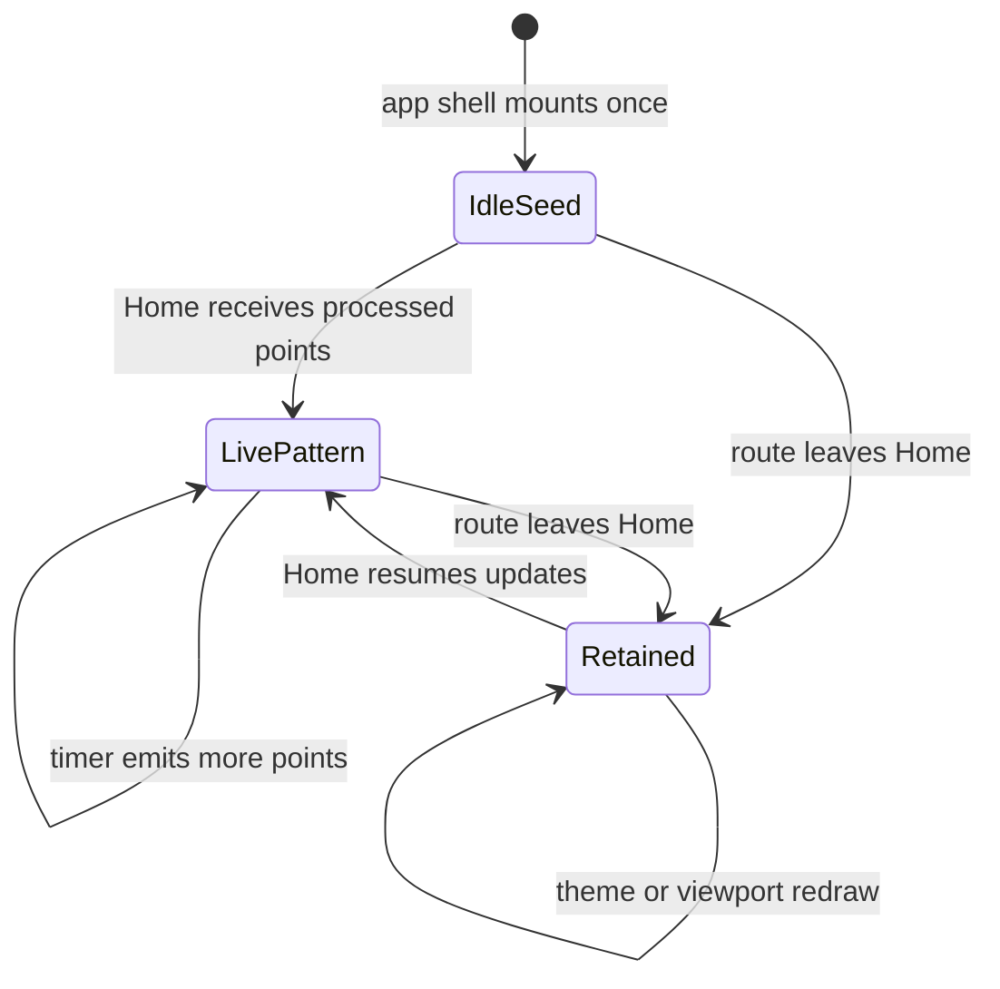

# Legacy Statistics and Persistent Canvas - Plan

## Goal Capsule

- **Objective:** Restore the 2019 Statistics chart section's composition with the installed shadcn Calendar and Chart, and keep one themed watercolor canvas and its pattern state mounted across route navigation.
- **Product authority:** The confirmed request in this plan overrides the origin document's earlier allowance for loose chart fidelity; `obsolete-2019:img/Charts.jpg` and the legacy SCSS govern the section layout.
- **Technical authority:** Current TanStack Start, React 19, Tailwind v4, shadcn, Recharts, preference, auth, and history-data boundaries remain in force.
- **Stop conditions:** Stop if implementation would require a data-model, repository, server-function, auth, raw-audio, or raw-image change.
- **Execution profile:** Presentation and client-state refactor with focused component tests, responsive browser verification, and the standard repository quality gate.
- **Tail ownership:** The implementing agent owns the focused implementation, regression coverage, SSR smoke, and cleanup of abandoned approaches; visual fine-tuning of shadcn's calendar/chart internals remains follow-up work.

---

## Product Contract

### Summary

Rebuild the History chart view around the old two-column gray Statistics section while retaining the current application stack and data source. Mount the watercolor canvas at the app shell so the same canvas and pattern survive Home, History, and Settings navigation.

### Problem Frame

The current History chart tab is a small inline SVG inside a generic content column. It omits the original Statistics experience: the translucent gray selector pane, calendar and date-range modes, white scrollable chart pane, summary copy, Pomodoro chart, view switcher placement, and responsive vertical composition.

The watercolor canvas is currently owned by the Home route. TanStack Router unmounts that route during navigation, so other pages lose the signature background and returning Home creates a new idle pattern. This breaks the visual continuity visible behind the legacy statistics panel.

### Requirements

**Statistics composition**

- R1. The History chart view must reproduce the desktop composition in `Charts.jpg`: an 80%-width, 70vh Statistics region with a one-third translucent gray selector pane and a two-thirds white scrollable chart pane.
- R2. The Statistics region must reproduce the legacy responsive behavior in spirit: desktop columns become a vertically stacked selector and chart region on narrow screens without losing access to either region.
- R3. The selector pane must offer Day, Week, Month, Year, and Custom modes with clear selected state, the applicable date input or navigation control, and a shadcn Calendar for day, week, and custom-range selection.
- R4. The chart pane must show recorded-event totals and counts plus Pomodoro totals for the active date range using the installed shadcn Chart primitives.
- R5. Summary text must report the active range's tracked duration, timer count, and Pomodoro count, including an informative empty state when the range has no entries.
- R6. The chart, table, and cards view switcher must retain all three current History views while matching the compact legacy placement and icon-led presentation.
- R7. Calendar and chart internals may differ from the 2019 widgets, but the outer panel geometry, translucency, spacing, scrolling, responsive stacking, and control placement must follow `Charts.jpg` and `obsolete-2019:frontend/src/Time.scss`.

**Persistent visual background**

- R8. One full-viewport `PatternCanvas` must remain mounted beneath the app content across Home, History, and Settings client-side navigation.
- R9. The app-level background must use the active preference theme and retain the same idle or live pattern across route transitions rather than reseeding or remounting.
- R10. Home must remain the only surface that updates the live pattern from microphone analysis; non-Home routes display but do not mutate the retained pattern.
- R11. The persistent canvas must remain decorative to pointer interaction, stay behind route content, resize with the viewport, and preserve SSR safety.

**Stable boundaries**

- R12. Anonymous demo entries, authenticated personal entries, loading/error states, and ownership isolation must continue to behave as they do now.
- R13. No raw audio or image payload may be introduced, accepted, or persisted; only the existing processed pattern points may enter the shared background state.
- R14. No database, repository, server-function, authentication, or preference-schema change is in scope.
- R15. No p5 or Sass dependency may be added; legacy SCSS is read-only design evidence and final styles remain Tailwind v4 plus `src/styles.css`.

### Key Flows

- F1. **Inspect daily statistics.** A user opens History, selects Charts, chooses a day in the calendar, and sees charts and summaries computed only from entries in that local-day range.
- F2. **Change time range.** A user switches among Day, Week, Month, Year, and Custom, updates the relevant selector, and sees both chart series and summary copy recomputed from the same inclusive range.
- F3. **Navigate with visual continuity.** A user starts with the idle spiral or accumulates a live timer pattern, navigates to History or Settings, and sees the same themed pattern without the canvas unmounting or reseeding.
- F4. **Change visual theme.** A user changes the saved theme in Settings and the already-mounted canvas redraws the retained pattern with the new theme.

### Acceptance Examples

- AE1. Given the desktop `Charts.jpg` reference, when the chart view renders at a common desktop width, then the gray selector pane, white chart pane, 1:2 column balance, 80% outer width, 70vh height, and view switcher placement are recognizable as the same interface.
- AE2. Given a narrow viewport, when the chart view renders, then selector and chart panes stack vertically within the same overall section and both remain scrollable and operable.
- AE3. Given entries inside and outside a selected range, when the user changes a calendar or period selection, then charts and all three summary counts include only the selected range.
- AE4. Given an active idle or live pattern on Home, when the user navigates Home to History to Settings and back using client-side links, then the same canvas node and pattern remain present throughout.
- AE5. Given an anonymous visitor or an authenticated user, when History loads, then demo-versus-personal entry selection and error handling remain unchanged.
- AE6. Given an SSR request for `/`, `/history`, or `/settings`, when the server renders the shell, then no browser-global or canvas access throws and the route returns successfully.

### Scope Boundaries

#### In scope

- Strict parity for the Statistics section's outer layout and responsive composition.
- Functional Day, Week, Month, Year, and Custom range selection over already-loaded history entries.
- Recorded-time/count and Pomodoro chart summaries using installed shadcn/Recharts primitives.
- Persistent app-shell canvas ownership and retained idle/live pattern state.

#### Deferred for later

- Pixel-level restyling of shadcn Calendar and Chart internals beyond fitting them into the legacy composition.
- Additional analytics, new chart types, comparison periods, export, timezone preferences, or server-side aggregation.
- Strict restyling of the existing cards and table surfaces.

#### Outside this product's identity

- Replacing the watercolor background with an abstract or generic dashboard treatment.
- Redesigning the Statistics surface instead of restoring its legacy structure.

### Product Contract Preservation

Changed the implementation interpretation of origin R9: the History chart surface now has strict outer-layout parity rather than the completed visual-parity plan's earlier loose treatment. Added persistent cross-route canvas behavior at the user's direction. The origin privacy, SSR, stack, and no-Sass constraints remain unchanged.

---

## Planning Contract

### Key Technical Decisions

- KTD1. **Keep history data fetching in the route.** `src/routes/history.tsx` continues to resolve demo or personal entries and passes the selected array into presentation components; the new statistics surface performs only pure client-side filtering and aggregation.
- KTD2. **Represent selection as an explicit range contract.** A small chart-range module owns Day, Week, Month, Year, and Custom selection boundaries and returns inclusive local-calendar ranges with an exclusive end instant, preventing the UI and transforms from inventing different rules.
- KTD3. **Build the restored surface as a dedicated component.** `TimeSummaryChart` becomes the composed Statistics view rather than expanding `HistoryPage` with calendar, range, summary, and chart state. The route remains responsible for tabs and auth/history states.
- KTD4. **Use shadcn as infrastructure, not as the visual specification.** `src/components/ui/calendar.tsx` and `src/components/ui/chart.tsx` supply accessible primitives; surrounding layout and scoped classes follow the legacy `.statMain`, `.timeSelect`, `.chartOuter`, `.timeOut`, `.iconOut`, and mobile variants.
- KTD5. **Aggregate both duration and event counts.** Extend pure transforms to derive elapsed seconds, timer counts, and Pomodoro counts for the selected range, with grouping appropriate to the range and deterministic ordering for chart axes.
- KTD6. **Lift canvas state to a provider inside the root preference boundary.** A client-safe background provider owns one seeded idle pattern, the retained live pattern, viewport size, and updater context; its canvas renders once alongside route children under `PreferencesProvider`.
- KTD7. **Preserve node identity through routing.** The background provider and canvas sit above route children in `RootDocument`, so TanStack Router swaps page content without replacing the canvas. Home consumes an updater callback and no longer renders its own canvas.
- KTD8. **Treat local calendar dates as UI boundaries.** Range selection uses local start-of-day/month/year semantics because the calendar and summary copy are user-facing local dates; ISO serialization is not used to truncate local dates before filtering.

### High-Level Technical Design

The component topology keeps data authority and persistent visual state separate:

The background lifecycle is intentionally independent of route lifecycle:

### Sequencing

1. Establish pure date-range and aggregation contracts before wiring UI state.
2. Build the Statistics composition against those contracts and existing History entry ownership.
3. Lift the canvas and pattern state into the app shell, then simplify Home to update shared state.
4. Finish with route-level, responsive browser, SSR, and full-gate verification.

### System-Wide Impact

- **Rendering:** Every route gains one fixed full-viewport canvas layer; page surfaces must retain an opaque or translucent foreground where the legacy design requires it.
- **State lifetime:** Pattern state changes from Home-route lifetime to app-shell lifetime but remains in-memory and client-only.
- **Performance:** One canvas persists rather than repeatedly loading theme images on navigation. Theme, viewport, or pattern changes still trigger redraws through the existing effect.
- **Privacy:** Shared state carries only existing `[max, min]` pattern points. It creates no persistence, request payload, or cross-user history path.
- **SSR:** Root-shell placement increases the number of routes rendering the bare canvas element, so root and route SSR smoke is part of completion.

### Risks and Mitigations

- **Date boundaries can drift by timezone.** Centralize range construction and filtering in pure functions and test local-day boundaries, exclusive ends, month/year rollover, and custom-range normalization.
- **Persistent background can obscure content or intercept input.** Keep it fixed, pointer-events-none, behind content, and verify translucent/opaque panel behavior at desktop and mobile widths.
- **Shadcn Calendar range and week selection APIs may not map directly to legacy modes.** Keep mode state in the feature component and adapt the Calendar's controlled `selected`/`onSelect` contract rather than modifying the generated primitive unless an accessibility defect requires it.
- **Chart density can overflow small panes.** Use the shadcn responsive chart container, horizontal label discipline, and the legacy pane's vertical scrolling; verify empty, sparse, and dense demo datasets.
- **Moving Home state can cause accidental pattern resets.** Seed once with a lazy provider initializer and test canvas identity plus retained pattern across route-child replacement.

### Sources and Research

- `docs/brainstorms/2026-06-27-ui-visual-parity-requirements.md` — original visual identity, History parity, privacy, no-Sass, and SSR contract.
- `obsolete-2019:img/Charts.jpg` — authoritative desktop Statistics composition.
- `obsolete-2019:frontend/src/Time.scss` — authoritative `.statMain`, selector/chart panes, view switcher, date controls, scrolling, and narrow-layout styles.
- `obsolete-2019:frontend/src/containers/Chart.js` — Day/Week/Month/Year/Custom modes, summary sections, and dual chart intent.
- `obsolete-2019:frontend/src/containers/Statistics.js` — chart/table/cards navigation placement and responsive variants.
- `src/components/ui/calendar.tsx` and `src/components/ui/chart.tsx` — installed shadcn primitives to reuse.
- `src/routes/history.tsx`, `src/features/charts/TimeSummaryChart.tsx`, and `src/features/charts/chart-transforms.ts` — current data flow and chart baseline.
- `src/routes/__root.tsx`, `src/routes/index.tsx`, and `src/components/PatternCanvas.tsx` — current shell, Home-owned state, and SSR-safe canvas renderer.

---

## Implementation Units

### U1. Define date-range and statistics transforms

- **Goal:** Provide deterministic, testable range selection, filtering, grouping, and summary data for every legacy period mode.
- **Requirements:** R3-R5, F1, F2, AE3.
- **Dependencies:** None.
- **Files:** Modify `src/features/charts/chart-transforms.ts` and `src/features/charts/chart-transforms.test.ts`; create `src/features/charts/chart-range.ts` and `src/features/charts/chart-range.test.ts` if separating selection state keeps the contracts clearer.
- **Approach:** Model the five period modes and normalize each selection to local start plus exclusive end. Filter already-loaded entries once, then derive recorded-event series with elapsed seconds and counts, a Pomodoro-count series, and summary totals from the same filtered set. Choose bucket granularity that remains readable for the selected period while retaining the legacy event-title grouping for the single-day view.
- **Patterns to follow:** Pure functions and fixture style in `src/features/charts/chart-transforms.ts` and `src/features/charts/chart-transforms.test.ts`; no I/O or user identity in transform inputs.
- **Test scenarios:** A selected local day includes entries at its start and before its exclusive end but excludes adjacent days; a week spans the selected calendar week; month and year selections handle rollover; a reversed or partial custom range normalizes safely; empty input yields empty series and zero summaries; multiple same-title entries aggregate elapsed time and count for a day; multi-day ranges group deterministically; only `isPomodoro` entries increment Pomodoro totals; all derived series and summary fields use the identical filtered set.
- **Verification:** Transform outputs fully describe the UI without additional date or aggregation logic in React components.

### U2. Restore the legacy Statistics chart composition

- **Goal:** Replace the minimal SVG chart with the legacy two-pane Statistics experience using shadcn Calendar and Chart primitives.
- **Requirements:** R1-R7, R12, F1, F2, AE1-AE3, AE5.
- **Dependencies:** U1.
- **Files:** Modify `src/features/charts/TimeSummaryChart.tsx`, `src/features/history/history-surfaces.test.tsx`, `src/routes/history.tsx`, `src/routes/-history.test.tsx`, and `src/styles.css`; create `src/features/charts/TimeSummaryChart.test.tsx` if the expanded interaction coverage is clearer outside the shared history-surface test.
- **Approach:** Turn `TimeSummaryChart` into a controlled-internally Statistics panel that receives only entries. Compose a selector pane with period buttons, controlled calendar/date controls, and a chart pane with recorded-event and Pomodoro sections, summaries, accessible tooltips/legends, and empty states. Restyle the History tab switcher as a compact icon-led control in the legacy top-right location while retaining text alternatives and tab semantics. Express the 80%/70vh/1:2 desktop structure, translucent gray selector, white scrollable results, and narrow stacked variant from the old SCSS in Tailwind or scoped CSS.
- **Execution note:** Start with interaction tests for range selection and summary updates, then fit the visual shell to `Charts.jpg` and `Time.scss`.
- **Patterns to follow:** `src/components/ui/calendar.tsx` controlled selection API; `src/components/ui/chart.tsx` responsive container, tooltip, and legend; current loading/demo/personal entry gating in `src/routes/history.tsx`; legacy `.statMain`, `.statMainPro`, `.timeSelect`, `.chartOuter`, `.timeOut`, `.iconOut`, and related selector styles.
- **Test scenarios:** Covers AE3: selecting a different day changes chart data and all summaries; Week, Month, Year, and Custom expose the correct selector and range; custom range selection includes both endpoint days; empty selected ranges show informative zero/empty states without invalid chart markup; recorded events expose elapsed and count series while Pomodoro uses only Pomodoro entries; tabs retain accessible names, selected state, and cards/table/chart switching; Covers AE5: anonymous demo entries and authenticated personal entries feed the same Statistics component without changing route ownership behavior; dense labels remain inside an overflow-safe chart container.
- **Verification:** Side-by-side inspection with `Charts.jpg` confirms the section geometry and control placement, while calendar/chart internals remain intentionally replaceable.

### U3. Lift the watercolor canvas into the persistent app shell

- **Goal:** Keep one canvas node and one idle/live processed pattern alive through route navigation while allowing Home to continue updating it.
- **Requirements:** R8-R11, R13-R15, F3, F4, AE4, AE6.
- **Dependencies:** None.
- **Files:** Create `src/features/audio/PatternBackgroundProvider.tsx` and `src/features/audio/PatternBackgroundProvider.test.tsx`; modify `src/routes/__root.tsx`, `src/routes/index.tsx`, `src/components/PatternCanvas.test.tsx`, and optionally `src/components/PatternCanvas.tsx` only if decorative semantics or sizing need a small reusable prop.
- **Approach:** Move lazy idle seeding, retained live-pattern state, viewport tracking, theme lookup, fixed background placement, and the single `PatternCanvas` render into a provider nested inside `PreferencesProvider` and above route children. Expose only a client-safe processed-pattern updater to Home. Preserve the last non-empty pattern across route changes and redraw it when preferences or viewport dimensions change. Keep the canvas fixed, pointer-inert, and below all route content.
- **Execution note:** Add a lifecycle characterization test that replaces route children while asserting canvas identity and retained pattern before removing the Home-owned instance.
- **Patterns to follow:** `PreferencesProvider` root lifetime and context shape; the lazy idle seed currently in `src/routes/index.tsx`; browser-only work inside effects as established by `PatternCanvas`.
- **Test scenarios:** Covers AE4: replacing Home children with History and Settings children leaves the same canvas DOM node mounted; a lazily seeded idle pattern is generated once per app-shell mount; live processed points supplied by Home remain after Home unmounts and are restored when it returns; empty updates do not unintentionally replace the retained pattern; changing the selected theme redraws the retained points with the new theme; viewport resize updates canvas dimensions; the background never captures pointer events; only `[max, min]` points enter context state; rendering under jsdom/SSR conditions does not access `window`, `Image`, or canvas context during render.
- **Verification:** Client-side route changes preserve canvas identity and pattern, while a full reload correctly starts a new in-memory background lifecycle.

### U4. Verify integrated history, navigation, responsiveness, and SSR

- **Goal:** Prove the restored Statistics surface and persistent canvas work together without regressing auth, privacy, routing, or other History views.
- **Requirements:** R1-R15, F1-F4, AE1-AE6.
- **Dependencies:** U1-U3.
- **Files:** Extend `src/routes/-history.test.tsx`, `src/features/history/history-surfaces.test.tsx`, and the focused chart/background tests from U2-U3; add a browser test under the repository's existing browser-test convention if available during implementation; modify documentation only if verification commands or architecture guidance changes.
- **Approach:** Exercise the integration seams rather than duplicating transform unit cases. Verify route-level entry ownership, tab behavior, canvas continuity across real client navigation, desktop/narrow Statistics layout, theme redraw, and server rendering. Use `Charts.jpg` and the legacy SCSS as visual acceptance evidence.
- **Execution note:** This unit is integration and visual proof; prefer SSR and real-browser smoke coverage over additional shallow snapshots.
- **Patterns to follow:** Existing History route mocks in `src/routes/-history.test.tsx`; project-wide SSR smoke contract; visual-parity reference workflow documented in `docs/plans/2026-06-27-002-refactor-ui-visual-parity-plan.md`.
- **Test scenarios:** Covers AE1 and AE2: desktop and narrow browser sizes preserve the legacy pane proportions or stacked layout with usable scrolling; Covers AE4: Home to History to Settings to Home keeps one canvas and retained pattern; Covers AE5: anonymous demos, authenticated empty history, account switch, failed fetch, and retry retain current isolation; Covers AE6: `/`, `/history`, `/settings`, and `/api/auth/*` return successfully with no render error; keyboard operation reaches period modes, calendar days, and view tabs with visible selected/focus state; chart tooltips and summaries expose equivalent accessible text; all routes remain usable over the background.
- **Verification:** Focused tests and browser/SSR smoke pass, then typecheck, lint, full tests, and production build complete without warnings attributable to this work.

---

## Verification Contract

| Gate | Units | Done signal |
|---|---|---|
| Focused chart range and transform tests | U1 | All period boundaries, filtering, grouping, and summaries are deterministic and timezone-safe at local calendar boundaries. |
| Statistics component and History route tests | U2, U4 | Period interactions, charts, summaries, tabs, demo/personal gating, empty states, and errors behave as specified. |
| Background provider and canvas tests | U3, U4 | One canvas and retained processed pattern survive route-child replacement, theme changes, and resize without SSR access. |
| Responsive browser inspection | U2, U4 | Desktop matches the `Charts.jpg`/SCSS composition and narrow view stacks both panes accessibly. |
| SSR smoke for `/`, `/history`, `/settings`, `/api/auth/*` | U3, U4 | Each surface returns successfully with no browser-global, canvas, hydration, or render error. |
| `npm run typecheck` | U1-U4 | TypeScript reports no errors. |
| `npm run lint` | U1-U4 | ESLint reports no errors. |
| `npm test` | U1-U4 | Full Vitest suite passes. |
| `npm run build` | U1-U4 | TanStack Start and Cloudflare production build succeeds with server/client import protection intact. |

---

## Definition of Done

- The History chart tab presents the full two-pane Statistics composition with all five legacy date modes.
- Desktop geometry, gray translucency, white chart pane, scrolling, switcher placement, and narrow stacking follow `Charts.jpg` and the old SCSS closely.
- Installed shadcn Calendar and Chart primitives render functional, accessible range selection and both statistics sections.
- Every chart and summary derives from one selected-range dataset, including duration, timer count, and Pomodoro count.
- Cards, table, anonymous demos, authenticated personal history, empty states, errors, and retry behavior remain intact.
- One app-shell canvas, its idle/live processed pattern, active theme, and viewport sizing persist across client-side route navigation.
- Home remains the sole producer of live processed pattern updates; no raw audio or images enter state or persistence.
- No schema, repository, server-function, auth, p5, or Sass change is introduced.
- Focused tests, responsive browser checks, SSR smoke, typecheck, lint, full tests, and production build satisfy the Verification Contract.
- Dead-end styling experiments, duplicate canvas mounts, unused transforms, and obsolete inline-SVG chart code are removed from the final diff.
